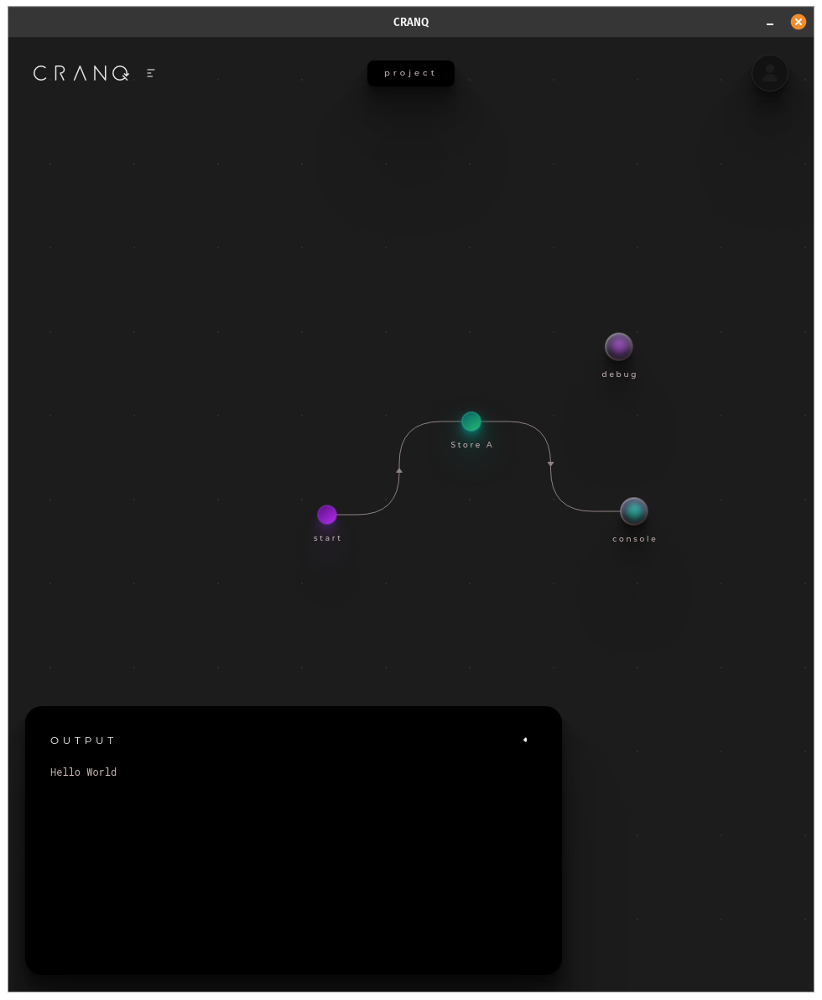
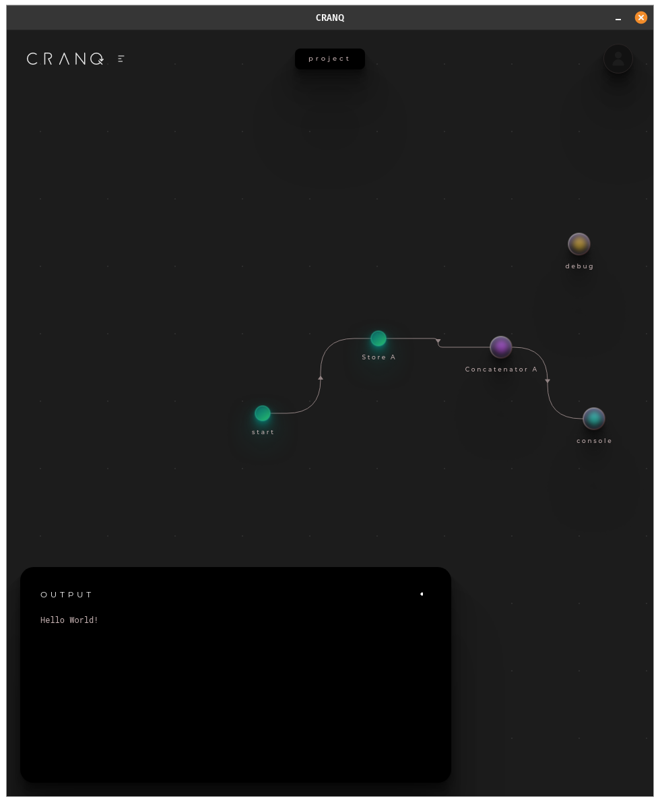
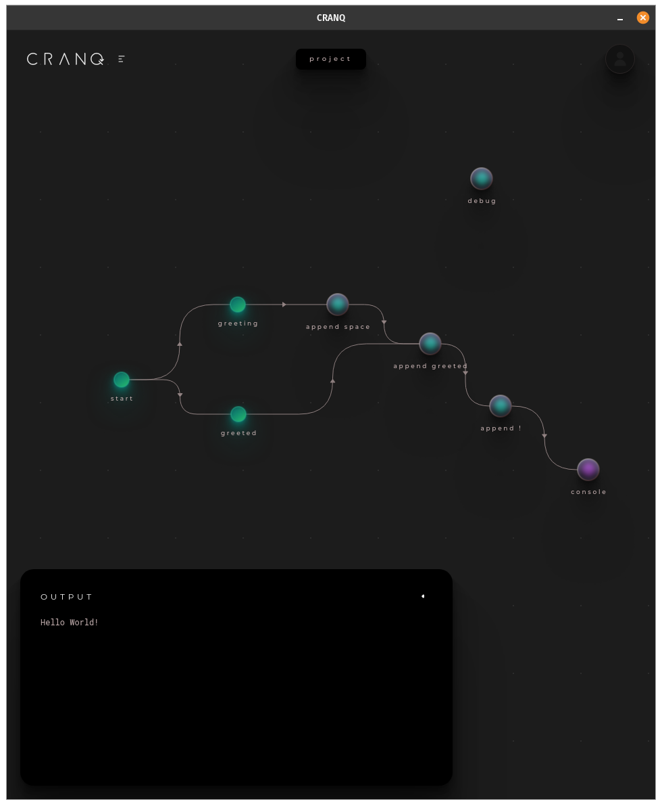
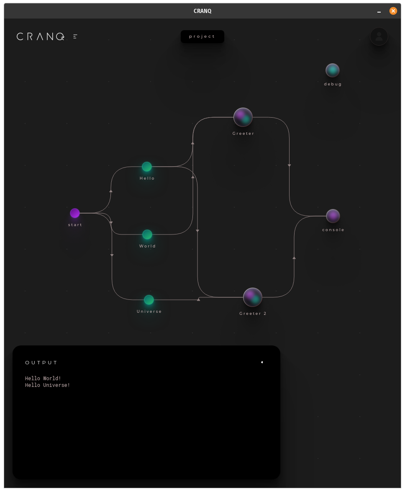
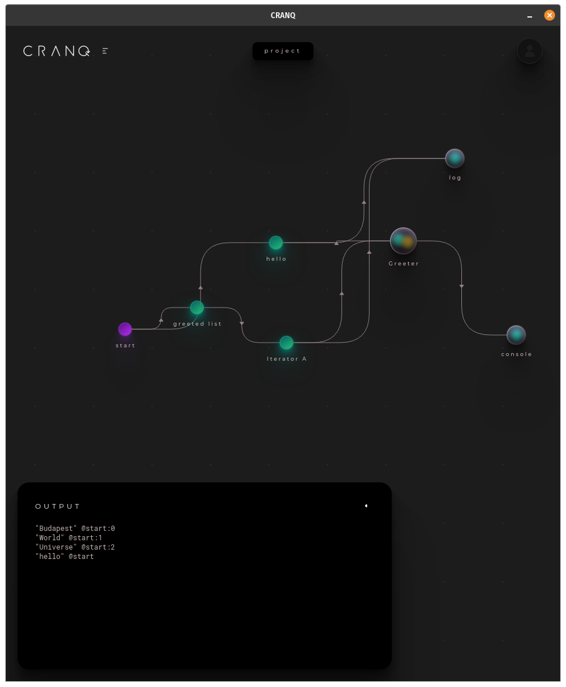
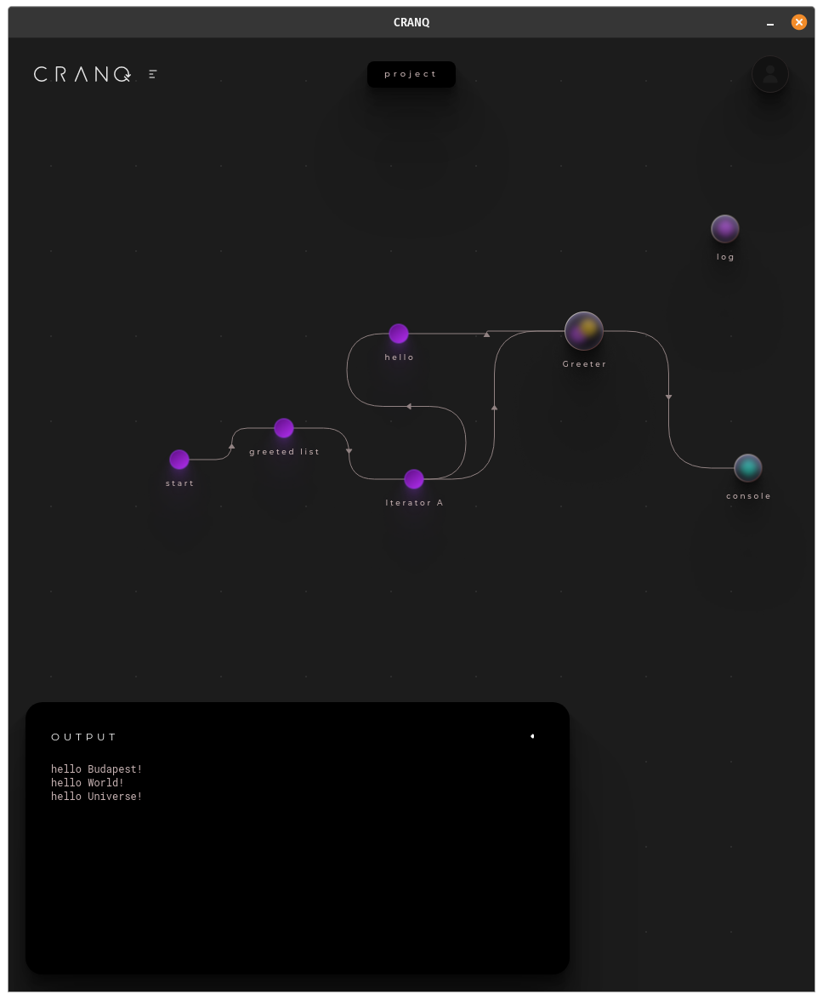

# CRANQ 101

## First steps - From "Hello World" to "List iterator greater"

### Step 1 - Hello Word

Objective: Write "Hello World" to the console

New concepts: 
 - create new node from search
 - store/read static values
 - start signal
 - connect nodes
 - run the app

### Step 2 - Concatenate strings

Objective: append "!"

New concepts: 
 - chaining multiple nodes

### Step 3 - Chainging transformations

Objective: Handling multiple values and chaining multiple transformations

New concepts: 
 - every node needs a start signal 
 - chaining multi step transformations
 - naming the nodes to have a self documenting graph

### Step 4 - Create a reusable custom node

Objective: Wrap multi step transformaion into a reusable structure node

New concepts:
 - create new blank node
 - name the new node's prototype for easy reuse
 - create inputs and output for the new node with proper naming

### Step 5 - Reuse custom node

Objective: Reuse the created custom node with different parameter

New concepts: 
- same output can be input of multiple nodes
- create a 2nd instance of our custom node

### Step 6 - Get parameters from a list and iterate

Objective: replace multiple parameters by an array an iterate through

New concepts: 
 - array iteration
 - sync signals with tags
 - why it fails? -> Debugging

