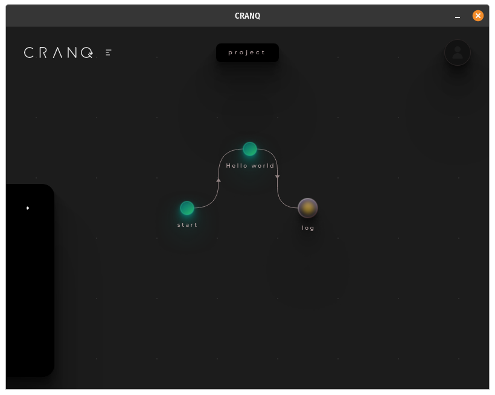
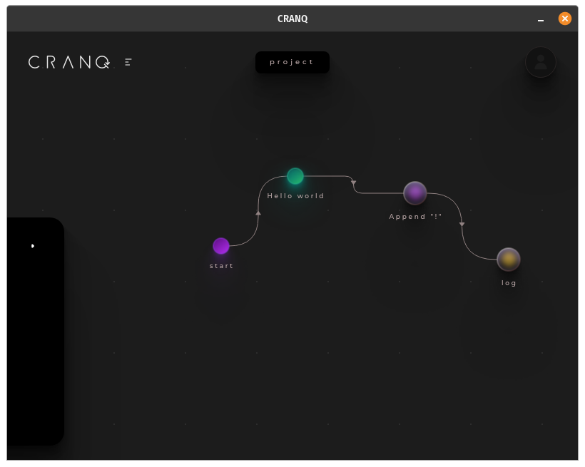
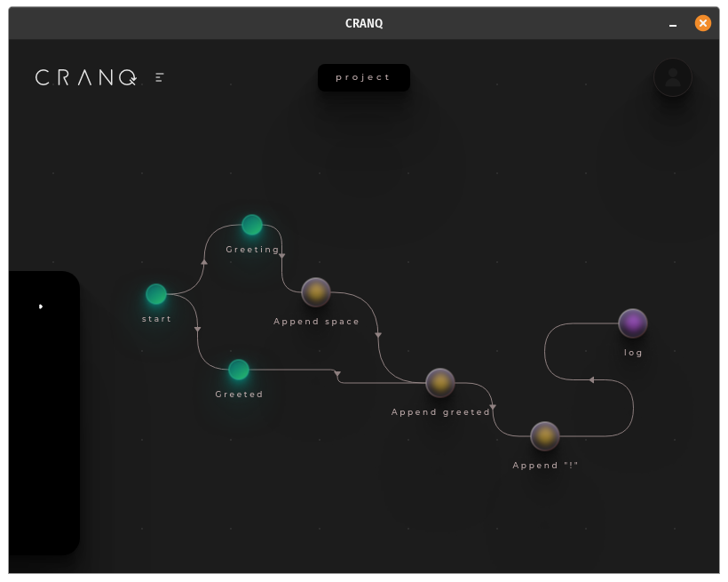
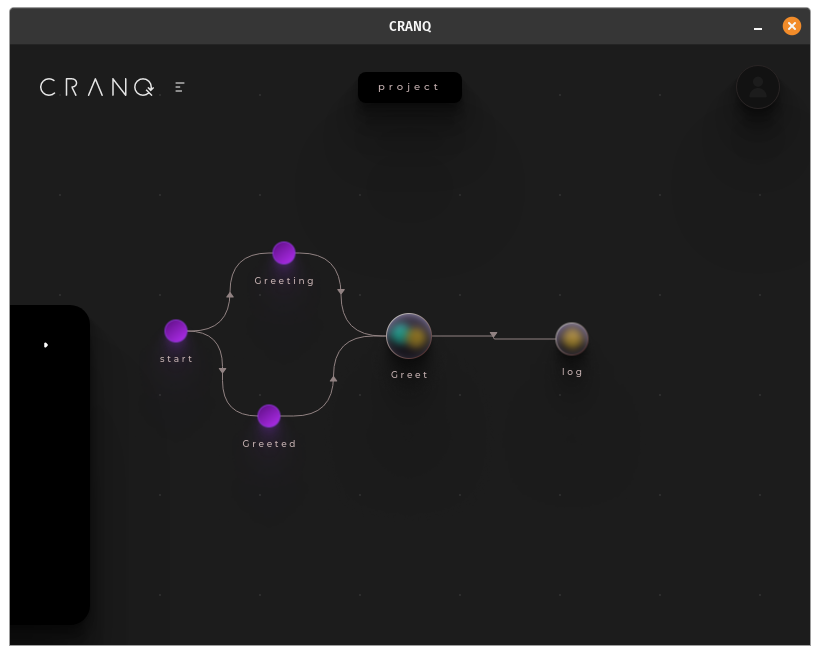
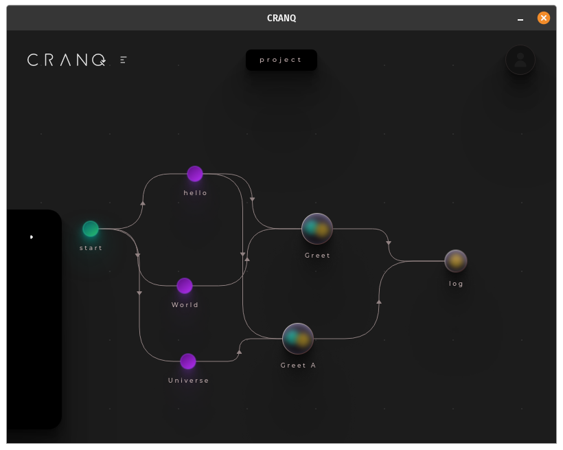
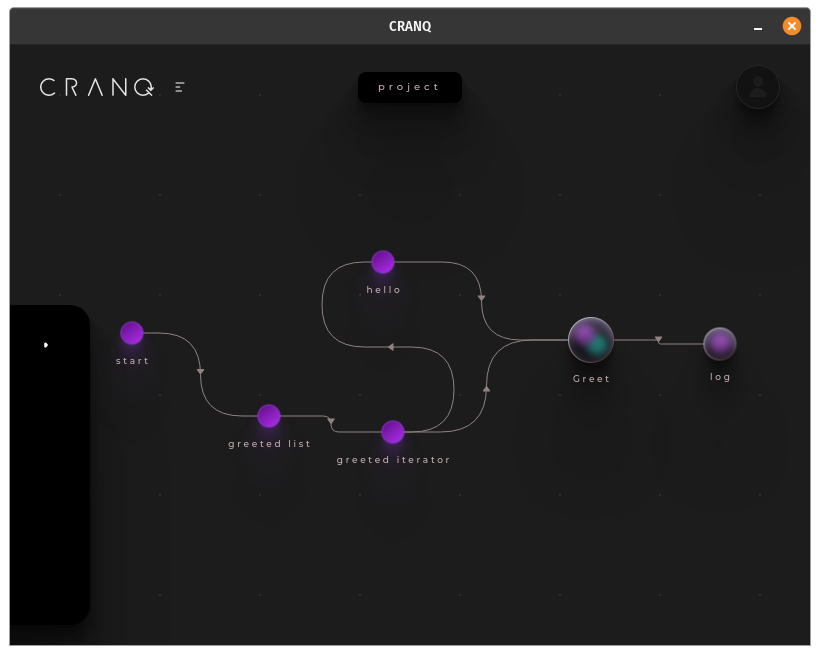

# CRANQ 101
:q
:q

## First steps - From "Hello World" to "List iterator greater"

### Step 1 - Hello Word

Objective: Write "Hello World" to the console

New concepts: 
- connecting nodes
- running the app
- checking the output
- deleting connection  
- inserting new node from search
- setting descriptive node names
- storing/reading static values in/from [Store] nodes
- logging data to the output

### Step 2 - Concatenate strings

Objective: append "!"

New concepts: 
- moving nodes
- moving the canvas
- showing/hiding inspector panel
- using the [Concatenator] node
- connecting nodes (input to output this time)

### Step 3 - Chainging transformations

Objective: Handling multiple values and chaining multiple transformations

New concepts: 
- chaining multiple transformations
- providing start signal to every node (direct or indirect)

### Step 4 - Create a reusable custom node

Objective: Wrap multi step transformaion into a reusable structure node

New concepts:
- deleting nodes
- creating new structure node
- setting the name of the new node and its prototype
- creating and name input and output ports
- entering and exiting a structure node
- connecting nodes to their parents input/output ports
  

### Step 5 - Reuse custom node

Objective: Reuse the created custom node with different parameter

New concepts: 
- same output can be input of multiple nodes
- adding a custom node via Search (using prototype name)  

### Step 6 - Get parameters from a list and iterate

Objective: replace multiple parameters by an array and iterate through

New concepts: 
- using the store the hold a list value
- iterating through a list
- debugging signals with [Data logger]
- synchronizing list iteration with a static input

