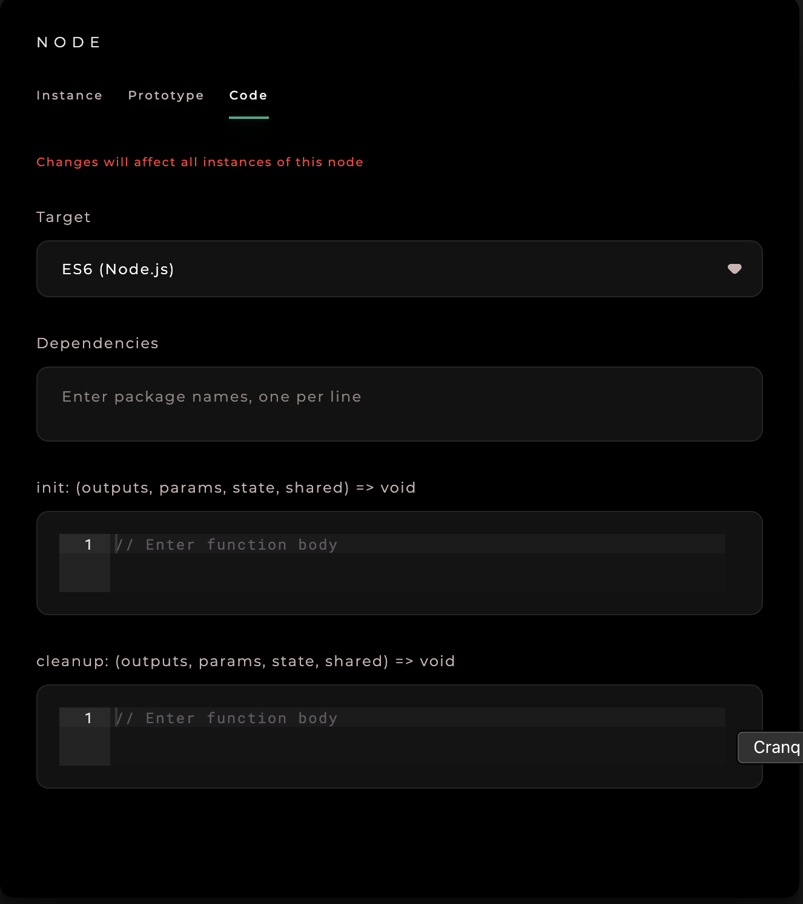

# CRANQ Academy

Do you want to make coding quicker?  Do you want to show and demonstrate your code in a more visual way?  CRANQ is a new way to program in a visual way, that lets you work a lot faster, and with fewer bugs than text code.  CRANQ's IDE is fully integrated with its repository, and designed for building in a simple but flexible visual programming paradigm.

CRANQ doesn't need a lot of prior programming experience.  Follow the tutorials in this section and pretty soon you will be shipping functionality like a pro.

Oh, by the way, you're using the Basic package right now, and there's nothing to pay.

## Your Roadmap

1. Head over to the [CRANQ website](https://cranq.io), and download CRANQ for your platform, if you haven't already!  It's easy, just click 'Download' in the hp top nav, and then open the file.
2. Move on to the CRANQ 101 video course at the base of the page to learn the basics!
3. Look up specific reference questions in our comprehensive database.  You 'll find a ton of information in there that will help you to solve problems
4. Give us a shout on our [Discord Channel](https://discord.gg/UgsjNtZW65) if you need further help!
