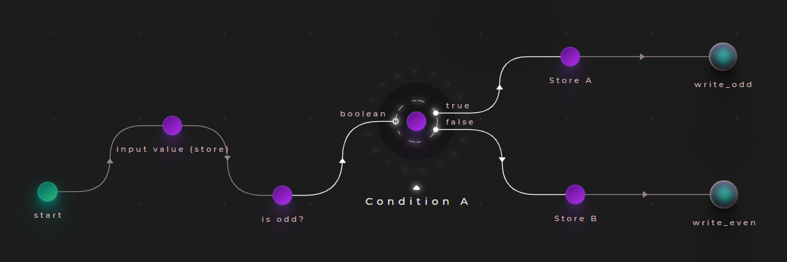
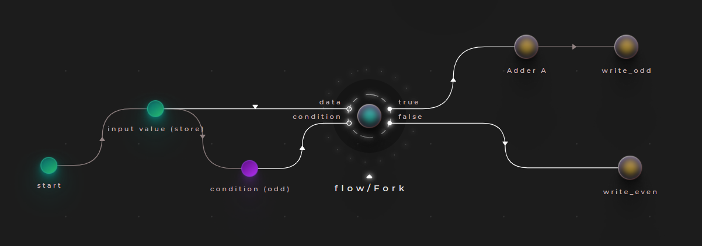
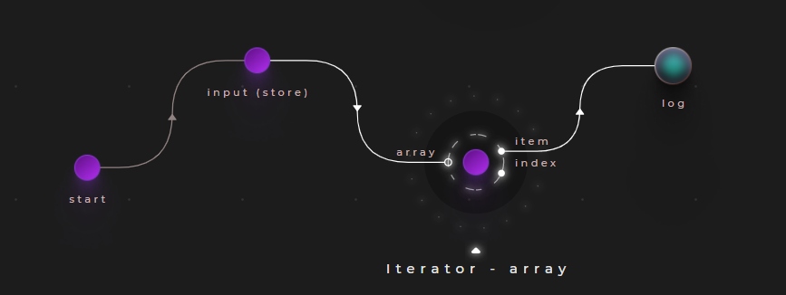
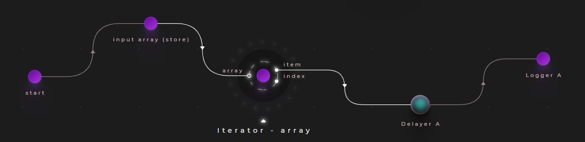
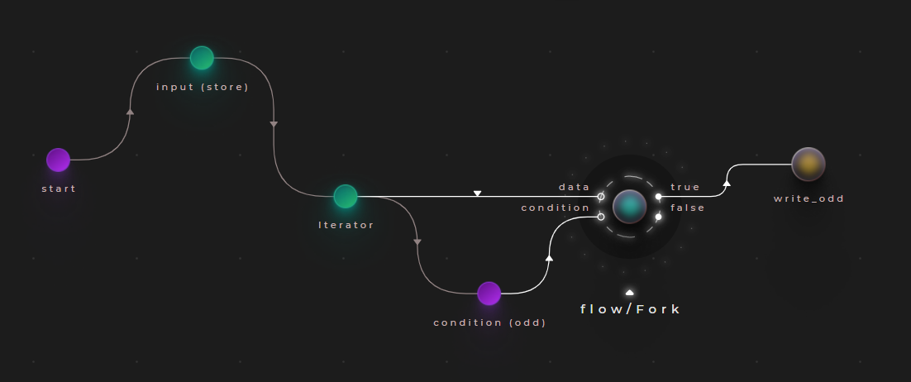
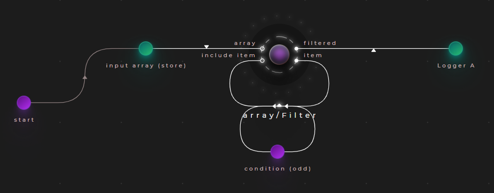
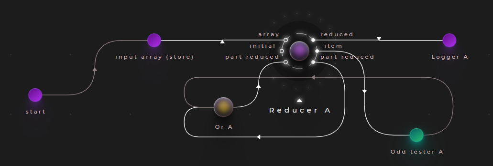

# Conditions

In Cranq, the imperative IF/ELSE statement can be performed by using:

### A "Fork" node:

Fork is a dataflow operation, which directs it's input signal to one of two directions, determined by a boolean condition. Essentially, it acts like a railway junction. In Cranq, it is implemented in the "flow/Fork" node.

Use "Fork":
- if you need to forward the data being inspected

### A "Condition" node:

If the redirection of the entire signal is not necessary, the "flow/Condition" node may be used - it simply triggers a signal on it's appropriate output, determined by a single boolean input.

Use "Condition":
- to transfer control only, without propagating the data


## Example 2.1

Let's implement a simple application, that determines whether an input number is even, or odd.

To accomplish this, we will connect our input to the built-in "number/Odd tester" node, and route it's output to a "flow/Condition" node instance.



## Example 2.2

Let's change our application in the following way:
- Increment odd numbers by 1
- Leave even numbers be
- Output the result

We will use the "flow/Fork" node for this purpose. Replace the "Condition" node in the previous example, connecting it like so:




Place an adder node on the "true" branch of the fork node, and connect it to the writer node. The "false" branch should be connected directly to its output.

# Collections - parallel processing

The closes analogy to an imperative "foreach" statement in Cranq is an "Iterator". It comes in two flavours:
- "data/array/Iterator" is designed for arrays
- "data/dictionary/Iterator" is for key-value pairs

As it's name suggests, an iterator iterates through a data collection, and emits a signal with each element on it's output. 

However, the iterator creates a new signal with distinct tags for each element - as a result:
- It is inherently parallel
- The order in which the outputs are emitted, is not deterministic
- The output signals of an iterator will need to be synchronized, if needed

## Example 2.1 - simple foreach

Consider a simple application, that takes an array as it's input, and outputs each element.



Take note of the output of this application:
```
1 @start:0
8 @start:1
13 @start:2
7 @start:3
2 @start:4
10 @start:5
84 @start:6
26 @start:7
```
The logger being used here outputs the signal data, along with it's tag. 
```
If you are unfamiliar with tags, please have a look at this[TODO: basic concepts]
```
Observing the tags here, we see that the iterator forked our original signal for each array item.

Let's extend this example with a delay, representing an expensive processing operation:



Upon executing this code, the parallel nature of the processing can be observed.

## Example 2.2 - parallel filtering

Let's combine the examples in 1.x & 2.x, and implement an application, that outputs the odd numbers of an array:



To accomplish this:
- We will iterate through our input as demonstrated above
- We will use the "number/Odd tester" node again, to make our decision
- Finally, we will use the "flow/Fork" node to direct only the odd numbers to the output node


# Collections - synchronous processing

As mentioned above, iterating in Cranq is parallel. For synchronous collection operations, Cranq provides the "data/array/Filter", "data/array/Reducer" and "data/array/Map" built-in nodes.


## Example 3.1 - synchronous filtering

Let's combine the examples 1.x & 2.x, and implement an application that selects & outputs the odd numbers from an array:



Place an instance of the "data/array/Filter" node:
- This node will iterate through each item in the array
- Each item will appear on it's "item" output
- The result of the "condition" node will determine whether the item will be included in the filtered resultset
- The execution of the node is parallel, but the result is synchronized

## Example 3.2 - mapping

TODO

## Example 3.3 - reduction

Let's take the problem from Example 3.1, and determine, whether the array contains odd values.



We use the "data/array/Reducer" node to inspect each array element, and determine, whether it is odd, or not. We will combine this result with the partially reduced result with a simple "OR" gate.

!Make sure, to give a starter value on the "initial" input. TODO: formatting


