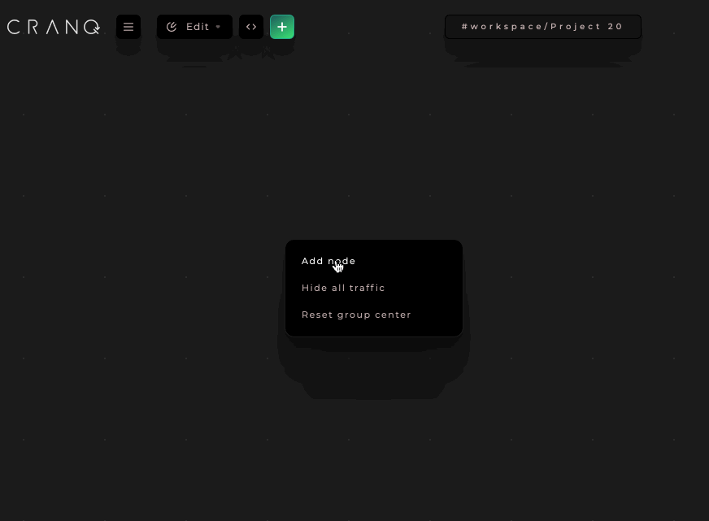
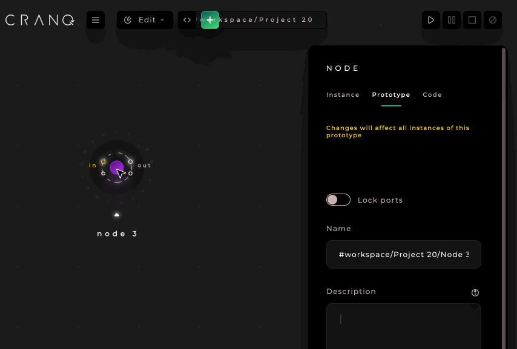
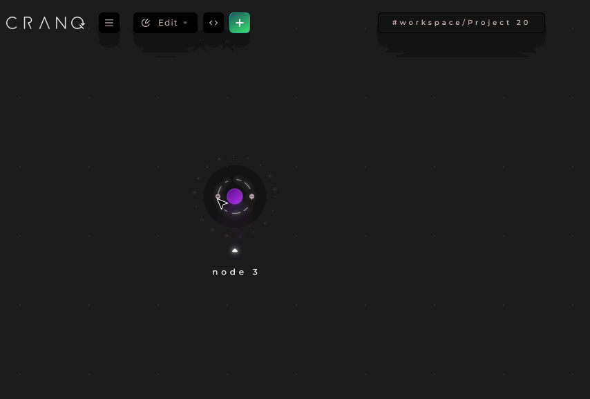
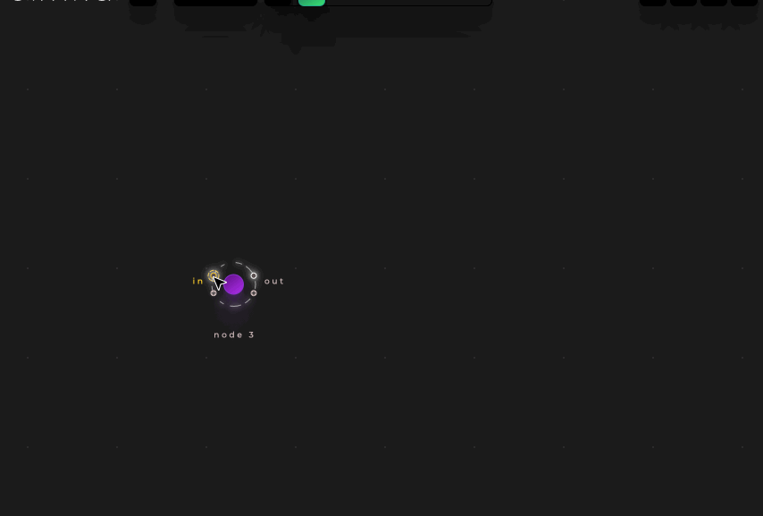
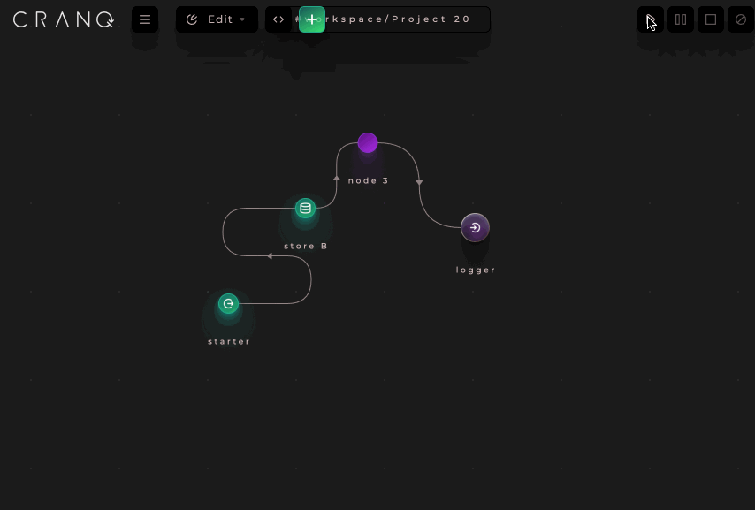

# Using external npm packages
 
NPM external packages can be used in code nodes[^1].
## Create a code Node
1. Right click on the canvas “Add node”.
2. On the pop up window bottom left click  “New Code Node” button.



## Add dependencies to the Node
1. Click to the middle of the node, 
2. Right side panel will pop up with the title “Node”. Choose the “code” tab. 
3. On the tab there is a dependencies field, where you can add external npm packages, one per line.
When the project starts this will be installed before the execution. 


## Use the package in the code node (with sample)
In this section we extend the code node above. It will receive a date in the following format "YYYYMMDD" and returns how many years the given date was.
1. Add an input and an output port to the Node:

2. Click to the "in" port.
3. On the right side Port inspector panel, choose the code tab add copy the following code to the editor: 
```javascript
const moment = require('moment'); // thats where we import the package to the code

outputs.out(moment(data, "YYYYMMDD").fromNow(), tag);
```


### Run your new code node
1. Add an input store with some date from the past in the given format.
2. Connect with a starter flow and add a logger to the end.


## How to check the packages which installed
1. Compile your project.
2. Uncompress the compiled tgz, and got to the project folder.
3. Check the dependencies in the package.json .

[^1]Most cases can be handled with a structure node. Please try to avoid creating new code nodes if possible.

