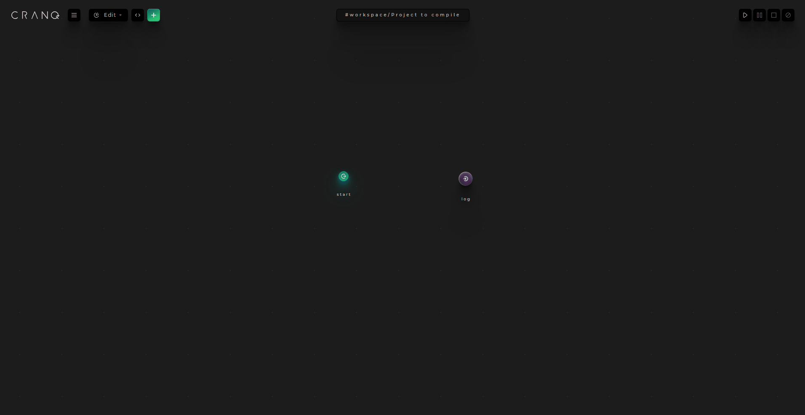

# Compiling programs

You can create [npm ](https://www.npmjs.com/)package from your CRANQ program.

### How to compile your pogram

* Select Compile menu
* Click on your compilation target (NodeJs or Browser)
* Save file dialog comes up
* The default package name is generated from the project name. You can rename it.
* Save the package.


Compilation is only successful when all the code nodes of the project have implementation for the compilation target. If the project contains node which doesn't have implementation of the selected target a notification appers about the issue.\
\



.png>)
