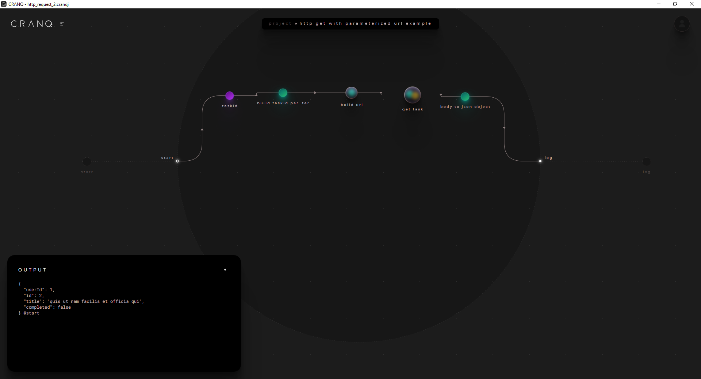
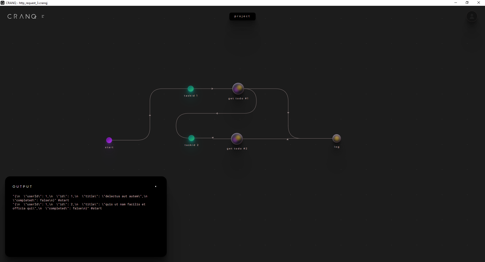
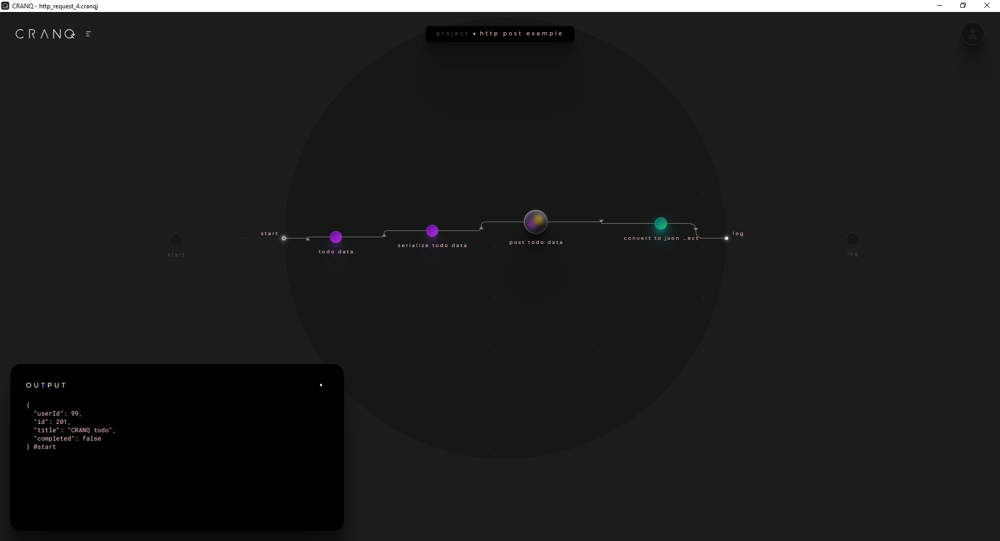
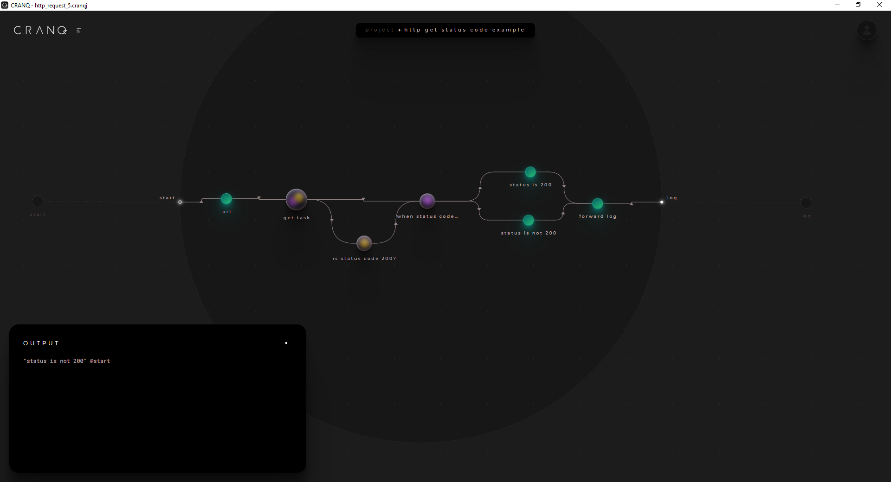
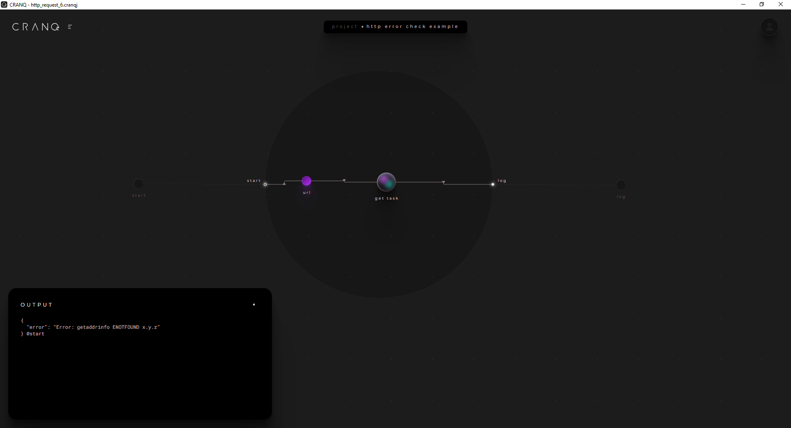

# CRANQ http-request

## Using http dispatcher - From "get task" to "post a todo item"

### Example 1 - Http Get

Objective: Get #1 task data from https://jsonplaceholder.typicode.com/ and write to the console

New concepts:

- use http dispatcher for getting data

**Steps:**

- Add new CRANQ project save it as http_request_1.cranqj
- Create a new structure node for the example
  - rename the node to **http get example**
  - add new input port to it and rename it to **start**
  - add new output port to it and rename it to **log**
- Navigate into the [http get example] node by double click
- We need a http dispatcher for calling the api
  - add a _io/http/Request dispatcher_ node by search
  - rename it to **get task**
  - set the _Value_ of the &lt;verb&gt; port to **"GET"**
  - set the _Value_ of the &lt;headers&gt; port to **""** (empty string)
  - set the _Value_ of the &lt;body&gt; port to **""** (empty string)
- We need at least one signal for triggering [get task] node. We use the &lt;url&gt; input port for it
  - add a new _data/Store_ node by search for storing the url of the api
  - rename it to **url**
  - set the _Value_ of the &lt;data&gt; port to **"https://jsonplaceholder.typicode.com/todos/1"**
- Connect the &lt;data&gt; output port of the [url] node to the &lt;url&gt; input port of [get task] node
- Connect the &lt;start&gt; input port of [http get example] parent node to the &lt;read&gt; input port of [url] node
- The data type of the _Value_ of &lt;body&gt; output of [get task] node is string. We would like to use it as an object so we need to parse it to JSON.
  - add _data/dictionary/JSON parser_ node by search
  - rename it to **body to json object**
- Connect the &lt;body&gt; output port of [get task] node to &lt;json&gt; input port of [body to json object]
- Connect the &lt;parsed&gt; output port of [body to json object] node to &lt;log&gt; output port of [http get example] parent node
- Save the project
- When you run the program you get the data of the todo with id 1

### Example 2 - Http Get with parameterized url

New concepts:

- use string templater

**Steps:**

- Load the previously created http_request_1.cranqj CRANQ project
- Save it as http_request_2.cranqj
- Rename the [http get example] node as **http get with parameterized url**
- Navigate into [http get with parameterized url] node
- Delete [url] node
- We need a node which can build the templated url
  - add a _string/Template filler_ node by search
  - name it **build url**
  - set its &lt;template&gt; input to **"https://jsonplaceholder.typicode.com/todos/{taskid}"**. The {taskid} is the token which will be replaced by the &lt;params&gt; input.
- Add a _data/Store_ node by search for storing the task id value which is being replaced {taskid} token in the url template.
  - name it **taskid**
  - set the _Value_ field of the <Data> input port to **2**.
- The [build url] node &lt;params&gt; input works with key value pairs so we need to convert dictionary the [taskid] node &lt;&data&gt; output to dictionary
  - add _flow/Syncer_ node by search
  - name it **build taskid parameter**
  - set the _Value_ field of the &lt;fields&gt; input port to **["taskid"]**. This generates a &lt;taskid&gt; spread port.
- Connect the &lt;read&gt; input port of [taskid] node to &lt;start&gt; input port of [http get with parameterized url] parent node
- Connect the &lt;data&gt; output port of [taskid] node to &lt;taskid&gt; input port of [build taskid parameter]
- Connect the &lt;synced&gt; output port of [build taskid parameter] node to &lt;params&gt; input port of [build url]
- Connect the &lt;filled&gt; output port of [build url] node to &lt;url&gt; input port of [get task]
- Save the project
- When you run the program you get the data of the todo with id 2

### Example 3 - Reusable Task getter node

New concepts:

- reusable structure node

**Steps:**

- Load the previously created http_request_2.cranqj CRANQ project
- Save it as http_request_3.cranqj
- Rename the [http get example] node as **reusable task getter example**
- Navigate into [reusable task getter example] node
- Delete every node expect the [taskid] and [body to json object] nodes
- Create a new node for getting todo data
  - Rename its prototye to **example/ Todo getter**
  - Rename its instance **get todo #1**
  - add new input port to it and rename it to **task id**
  - add new output port to it and rename it to **task**
- Navigate int [get todo #1]
- Build the get todo logic based on the http_request_2 example
  - add _flow/Syncer_ node by search and name it **build taskid parameter**
    - set the _Value_ field of the &lt;fields&gt; input port to **["taskid"]**
  - add _string/Template filler_ node by search and name it **build url**
    - set the _Value_ field of its &lt;template&gt; input port to **"https://jsonplaceholder.typicode.com/todos/{taskid}"**.
  - add _io/http/Request dispatcher_ node by search. Name it **get todo data**
    - set _Value_ field of its &lt;verb&gt; input port to **"GET"**.
    - set the _Value_ field of its &lt;headers&gt; input port to **""** (empty string)
    - set the _Value_ field of its &lt;body&gt; input port to **""** (empty string)
  - connect the &lt;taskid&gt; input port of [build taskid parameter] node to &lt;taskid&gt; input port of [get todo #1] parent node
  - connect the &lt;synced&gt; output port of [build taskid parameter] node to &lt;params&gt; input port of [build url] node
  - connect the &lt;filled&gt; output port of [build url] node to &lt;url&gt; input port of [get todo data] node
  - connect the &lt;body&gt; output port of [get todo data] node to &lt;task&gt; output port of [task] port of [get todo #1] parent node
- Navigate back to [reusable task getter example] node
- Add a _example/ Todo getter_ node by search.
  - rename it **get todo #2**
- Rename [taskid] node to **taskid 1**
- Set the _Value_ of the &lt;data&gt; input port of [taskid 1] node to **1**
- Add a _data/Store_ node by search
  - name it **taskid 2**
  - set the _Value_ of the &lt;data&gt; input port of [taskid 2] node to **2**
- Connect the &lt;read&gt; input port of [taskid 1] node to &lt;start&gt; input port of [reusable task getter example] parent node
- Connect the &lt;data&gt; output port of [taskid 1] node to &lt;task id&gt; input port of [get todo #1] node
- Connect the &lt;task&gt; output port of [get todo #1] node to &lt;read&gt; input port of [taskid 2] node
- Connect the &lt;data&gt; output port of [taskid 2] node to &lt;task id&gt; input port of [get todo #2] node
- Connect the &lt;task&gt; output port of [get todo #1] node to &lt;json&gt; input port of [todo response to json] node
- Connect the &lt;task&gt; output port of [get todo #2] node to &lt;json&gt; input port of [todo response to json] node
  b - Save the project
- When you run the program you get the data of the todo with id 1 and id 2

### Example 4 - Http Post

Objective: Post #201 task to https://jsonplaceholder.typicode.com/todos and write the result to the console

New concepts:

- use http dispatcher for posting data

**Steps:**

- Add new CRANQ project save it as http_request_4.cranqj
- Create a new structure node for the example
  - rename the node to **http post example**
  - add new input port to it and rename it to **start**
  - add new output port to it and rename it to **log**
- Navigate into the [http get example] node by double click
- We need a http dispatcher for calling the api
  - add a _io/http/Request dispatcher_ node by search
  - rename it to **post todo data**
  - set the _Value_ of the &lt;verb&gt; input port to **"POST"**
  - set the _Value_ of the &lt;url&gt; input port to **"https://jsonplaceholder.typicode.com/todos"**
  - set the _Value_ of the &lt;headers&gt; input port to **{"content-type": "application/json"}**
- We need a _data/Store_ for storing the post data
  - add it by search
  - rename it to **todo data**
  - set the _Value_ of the &lt;data&gt; input port to **{"userId": 99,"id": 201,"title": "CRANQ todo", "completed": false}** JSON
- The data type of the _Value_ of &lt;body&gt; input of [post todo data] node is string. We need a JSON serializer to be able to connect to [todo data].
  - Add a _data/dictionary/JSON serializer_ node by search.
  - rename it to **serialize todo data**
- The data type of the _Value_ of &lt;body&gt; output of [get task] node is string. We would like to use it as an object so we need to parse it to JSON.
  - add _data/dictionary/JSON parser_ node by search
  - rename it to **body to json object**
- Connect the &lt;read&gt; input port of [todo data] node to &lt;start&gt; input port of [http post example] parent node
- Connect the &lt;data&gt; output port of [todo data] node to &lt;dict&gt; input port of [serialize todo data] node
- Connect the &lt;json&gt; output port of [serialize todo data] node to &lt;body&gt; input port of [post todo data] node
- Connect the &lt;body&gt; output port of [post todo data] node to &lt;json&gt; input port of [convert to json object] node
- Connect the &lt;parsed&gt; output port of [convert to json object] node to &lt;log&gt; output port of [http post example] parent node
- Save the project
- When you run the program you get the data of the new todo with id 201

### Example 5 - Check Http dispatcher status

Objective: Try to get data from invalid resource and check if the response status is 200 and write the result of the check to the console

New concepts:

- use equality checker
- use fork

**Steps**

- Load the previously created http_request_1.cranqj CRANQ project
- Save it as http_request_5 .cranqj
- Rename the [http get example] node as **http get with parameterized url**
- Navigate into [http get with parameterized url] node
- Delete [body to json object] node
- Set the _Value_ of the &lt;data&gt; input port of <url> node to **"https://jsonplaceholder.typicode.com/a/todos/1"** (not existing endpoint)
- Add _number/Equality tester_ for checking the status code
  - rename it to **verify status code**
  - set the _Value_ of the &lt;b&gt; input port **200**
- Add _flow/Fork_ node for write the proper message to the console based on the status code verification
  - add the node by search
  - rename it to **is status code 200?**
- Add _data/Store_ nodes for storing the verification result messages
  - add the first node by search
  - rename it to **status is 200**
  - set the _Value_ of the &lt;data&gt; input port **"status is 200"**
  - add the second node by search
  - rename it to **status is not 200**
  - set the _Value_ of the &lt;data&gt; input port **"status is not 200"**
- Connect the &lt;status&gt; output port of [get task] node to &lt;a&gt; input port of [verify status code] node
- Connect the &lt;status&gt; output port of [get task] node to &lt;data&gt; input port of [is status code 200?] node
- Connect the &lt;true&gt; output port of [is status code 200?] node to &lt;data&gt; input port of [status is 200] node
- Connect the &lt;false&gt; output port of [is status code 200?] node to &lt;data&gt; input port of [status is not 200] node
- We want to connect both the <status is 200> and <status is not 200> nodes to the &lt;log&gt; output of the so we need a _flow/Forwarder_
- add _flow/Forwarder_ node by search
  \_ rename it to forward log
- Connect the &lt;data&gt; output port of [status is 200] node to &lt;data&gt; input port of [forward log] node
- Connect the &lt;data&gt; output port of [status is not 200] node to &lt;data&gt; input port of [forward log] node
- Connect the &lt;data&gt; output port of [forward log] node to &lt;log&gt; input port of [http get status code example] parent node
- Save the project
- When you run the program you see the following log message: _"status is not 200" @start_ which is correct because the status code was 404

### Example 6 - Check Http dispatcher error

Objective: Get data from not existing url and write the error to the console

New concepts:

- use Http dispatcher error output port

**Steps:**

- Load the previously created http_request_1.cranqj CRANQ project
- Save it as http_request_6.cranqj
- Rename the [http get example] node as **http error check example**
- Navigate into the [http error check example] node by double click
- Set the _Value_ of the &lt;data&gt; port to invalid url **"http://x.y.z"**
- Delete node [body to json object]
- Connect the &lt;error&gt; output port of [get task] node to &lt;log&gt; output port of [http get example] parent node
- Save the project
- When you run the program you see the following log message: {
  "error": "Error: getaddrinfo ENOTFOUND x.y.z"
  } @start
