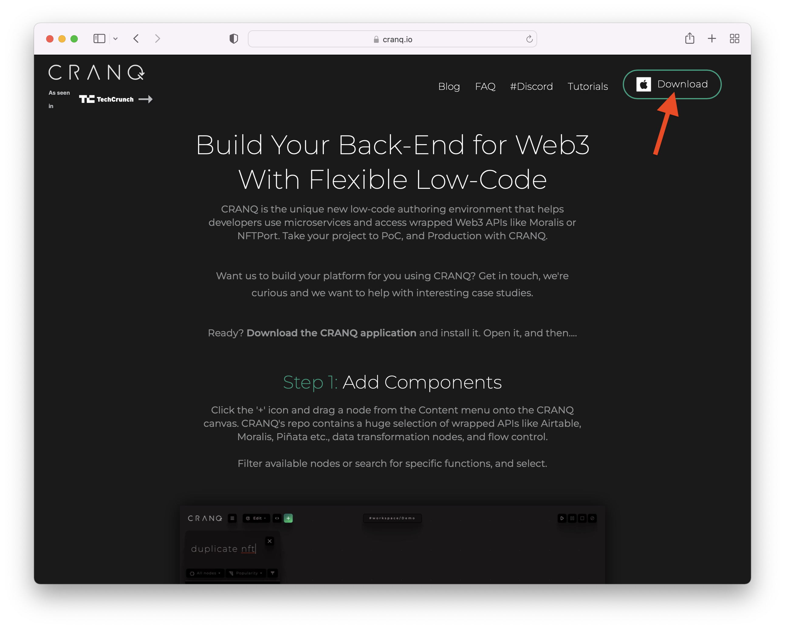

# 🐣 Getting started

To get you started in CRANQ, we'll build a simple program that samples the current BTC-USD price via the [Yahoo Finance](https://uk.finance.yahoo.com/) API, and prints it to the console.


The Yahoo Finance API is not supported by Yahoo anymore, but we'll use it in this lession anyway, as it's still operational, and doesn't  require any setup, like API keys.


## Step 1: Download & install CRANQ

Head to [https://cranq.io](https://cranq.io) and download the latest CRANQ installer. CRANQ is a desktop app available for Windows, MacOS, and Ubuntu.

 

Once downloaded, install and start the app.

## Step 2: Add nodes from the repo

After starting CRANQ for the first time you'll be greeted by an empty project on the _canvas,_ pre-populated with two nodes you'll most likely need:

* a starter node that sends a signal when you run the program,
* and a logger node that logs whatever data it receives to the console.


The canvas is where you build, navigate, run, and analyze CRANQ programs in a visual way.


Steps:

1. Open the repo contents through the green plus button in the header.
2. In the repo's search field, type "yahoo". Among the first couple of results you'll see one called "Market price getter". Drag that node from the list and drop it on the canvas.
3. Then go back to search and type "param". Drag the one called "Parameter" onto the canvas. We'll need this to turn the symbol that we'll enter later into a signal.

 .png>) .png>)

## Step 3: Set node parameters

This first CRANQ program of ours will require only one parameter: the instrument symbol, which in this case will be "BTC-USD".&#x20;

Let's click on the `parameter` node's `data` input, and in the inspector panel that appears on the right, enter "BTC-USD" (including the double quotes) into the "value" field.


[Currently](../roadmap.md#forms), parameters can only be entered as JSON.


## Step 4: Connect nodes

At this point we have all the necessary nodes, set up with parameters. To complete the program, we just need to connect up the nodes.

1. Connect the `start` output of the `start` node to the `read` input of the `parameter` node. This way starting the program will trigger reading the symbol we entered manually, and passing it on to the next connected node.
2. For the current market price of "BTC-USD" to be read from the Yahoo Finance API, we need to send the symbol to the API node. Connect the `data` output of `parameter` to the `symbol` input of `market price getter`.
3. Finally, to display the price in the app, connect the `price` output of `market price getter` to the `data` input of `log`.

  

We're done! All it took was dragging 2 nodes from the repo, setting a parameter, and making 3 connections.

We're ready to test and analyze the program we just made.

## Step 5: Run app

To run the program, click on the 'play' button in the header. You'll notice that the nodes turn grey, and then gradually, green. When the program finishes, the BTC-USD price should be visible in the console window, which just opened.

  

CRANQ wouldn't be CRANQ if that was all to running a program. Try adding traffic viewer windows to all 3 connections via their context menus. In each window, you'll see the last signal transmitted through the corresponding connection. With these traffic viewers, you can trace the program's progression and see what's happening at each stage.

If you change the symbol value on the `data` value of `parameter` (to ETH-USD), and run the program again, you'll notice how the contents of the traffic viewer windows change accordingly.
