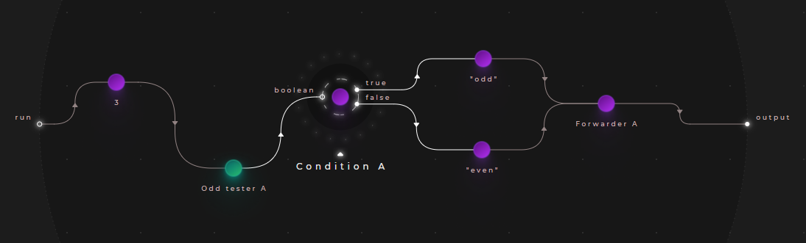
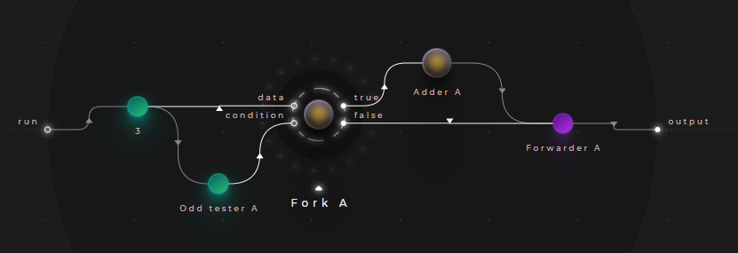

# Junctions

In Cranq, the imperative IF/ELSE statement can be performed by using:

### A "Fork" node:

Fork is a dataflow operation, which directs it's input signal to one of two directions, determined by a boolean condition. Essentially, it acts like a railway junction. In Cranq, it is implemented in the ```flow/Fork``` node.

Use "Fork":
- if you need to forward the data being inspected

### A "Condition" node:

If the redirection of the entire signal is not necessary, the ```flow/Condition``` node may be used - it simply triggers a new signal - without conveying data - on it's appropriate output, determined by a single boolean input.

Use "Condition":
- to transfer control only, without propagating the data

### A "Gate" node:

The ```flow/Gate``` acts like a railway signal - it forwards the input it is given only if it receives a boolean "true" value on it's "open" input - otherwise, it blocks the flow.

Use the "Gate":
- to conditionally block or open parts of the dataflow graph

## Example - Using conditions

> **_Try out:_**
>
> Place node **tutorials/flow/Condition example**

Let's implement a simple application, that determines whether an input number is even, or odd.

To accomplish this, we will connect our input to the built-in ```number/Odd tester``` node, and route it's output to a ```flow/Condition``` node instance.



## Example - Using forks

> **_Try out:_**
>
> Place node **tutorials/flow/Fork example**

Let's change our application in the following way:
- Increment odd numbers by 1
- Leave even numbers be
- Output the result

We will use the ```flow/Fork``` node for this purpose. Replace the condition node in the previous example, connecting it like so:




Place a ```number/Adder``` node on the "true" branch of the ```flow/Fork``` node, and connect it to the output. The "false" branch should be connected directly to the output.

## Example - Using gates

> **_Try out:_**
>
> Place node **tutorials/flow/Gate example**

Let's change the example above in the following way:
- Output odd numbers
- Output a default value for even numbers


In this example, we use 2 ```flow/Gate nodes``` to forward the appopriate data to our output. Each gate receives the result of the condition, with the default value being reversed with a ```boolean/Not``` node.