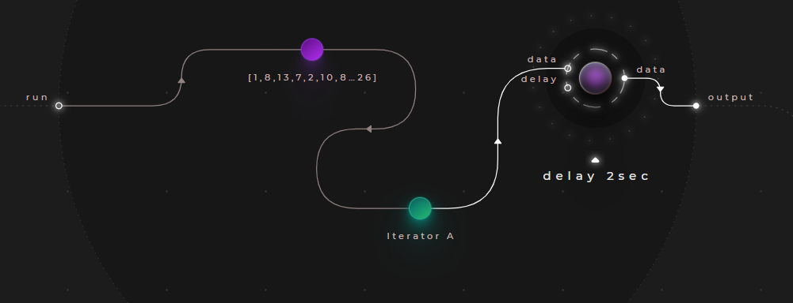
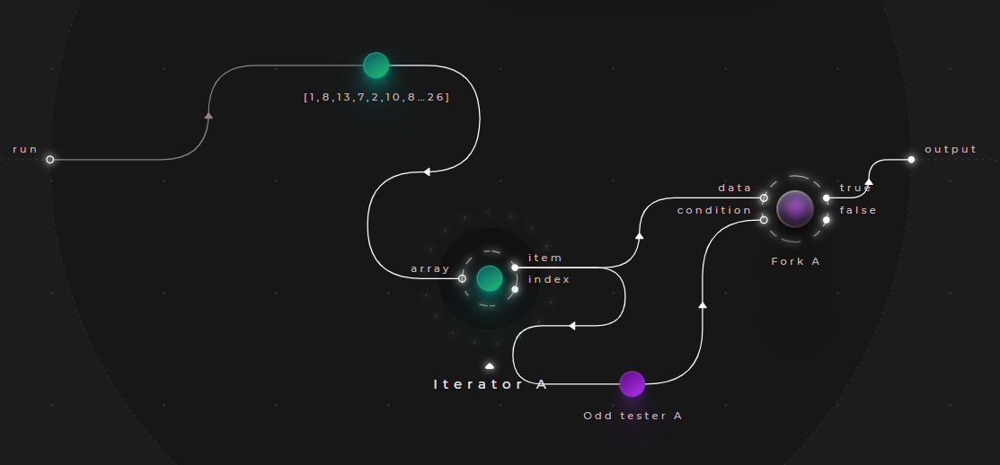
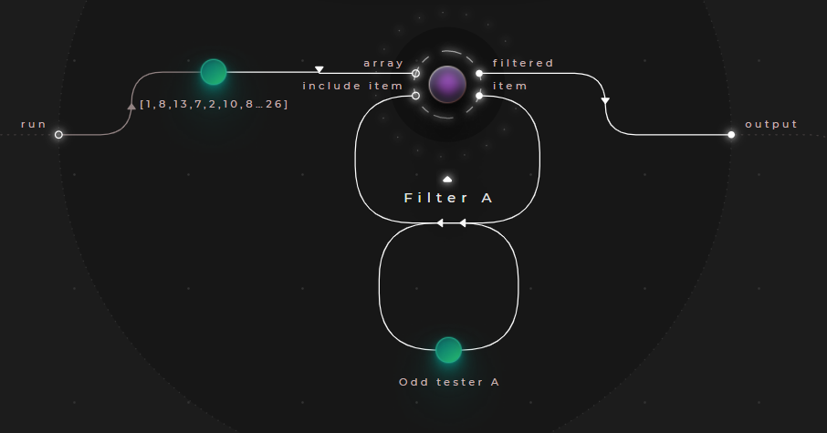
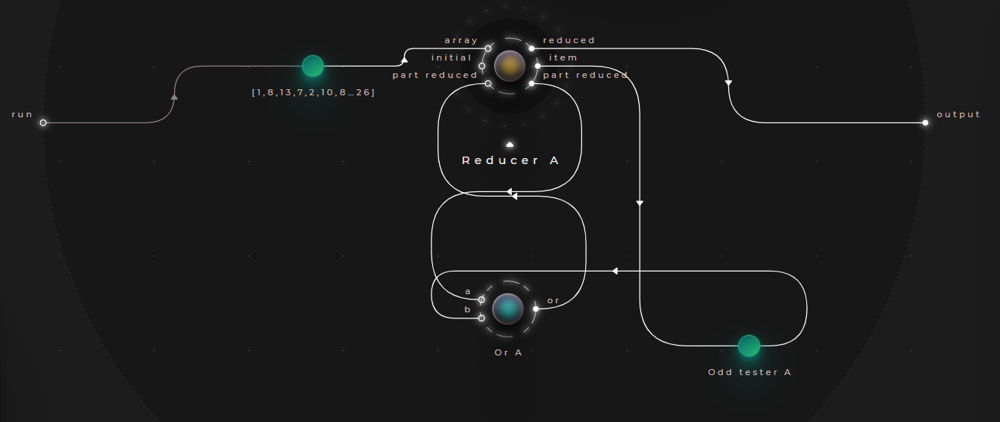
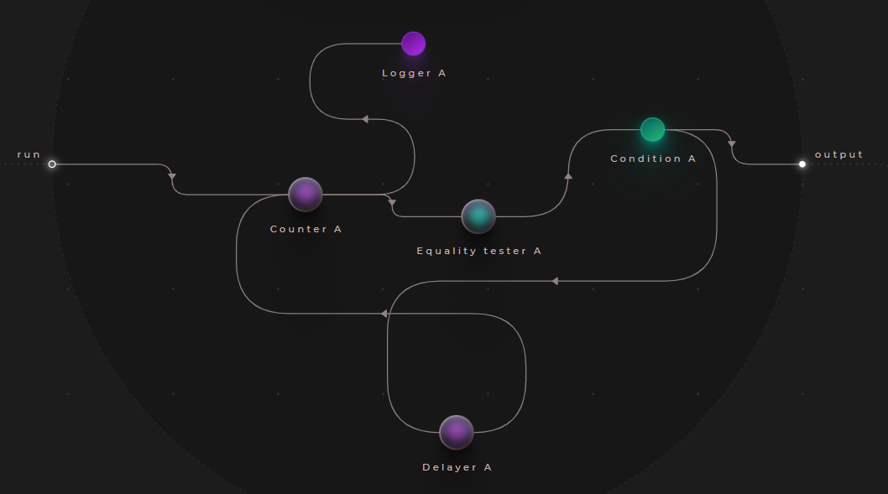

# Iterators / loops

The closes analogy to an imperative "foreach" statement in Cranq is an "Iterator". It comes in two flavours:
- ```data/array/Iterator``` to work with arrays
- ```data/dictionary/Iterator``` for dictionaries/key-value pairs

As it's name suggests, an iterator iterates through a data collection, and emits a signal with each element on it's output. 

However, the iterator creates a new signal with distinct tags for each element - as a result:
- The processing is parallel
- The order in which the outputs are emitted, is not deterministic
- The output signals of an iterator will need to be synchronized, if needed

## Example - simple foreach

> **_Try out:_**
>
> Place node **tutorials/flow/Iterator**

Consider a simple application, that takes an array as it's input, and outputs each element.


- The example uses a store as data source:
  ```json
    [1,8,13,7,2,10,84,26]
  ```
- Connect this store to an ```data/array/Iterator```

Take note of the output of this application:
```
1 @start:0
8 @start:1
13 @start:2
7 @start:3
2 @start:4
10 @start:5
84 @start:6
26 @start:7
```
The logger being used here outputs the signal data, along with it's tag. 

Observing the tags here, we see that the iterator forked our original signal for each array item.

Let's extend this example with a ```flow/Delayer```, representing an expensive processing operation - this will block the flow of data for each element. Set the ```delay``` input to 2000, representing 2000ms/2sec:



Upon running this, the whole operation will be concluded in 2 seconds, demonstrating the parallel nature.

## Example - Parallel filtering

> **_Try out:_**
>
> Place node **tutorials/flow/Iterator (parallel filter) example**

Let's combine the examples of the [Junctions section](../1_1_junctions/README.md) with the one above, and implement an application, that outputs the odd numbers of an array:



To accomplish this:
- We will iterate through our input as demonstrated above
- We will use the ```number/Odd tester``` node to make our decision
- Finally, we will use the ```flow/Fork``` node to direct only the odd numbers to the output node

### Test data:

```json
[1,8,13,7,2,10,84,26]
```

### Sample output:

```
1 @start:0
13 @start:2
7 @start:3
```


## Example - Synchronous filtering

> **_Try out:_**
>
> Place node **tutorials/flow/Filter example**

> **_More info:_**
>
> For more information & examples on using the filter, have a look at **[Querying data - Using filters](../../3_querying_data/3_2_filters/README.md)**

As mentioned above, the iterator nodes in Cranq are parallel. For synchronous collection operations, Cranq provides the ```data/array/Filter```, ```data/array/Reducer``` and ```data/array/Mapper``` built-in nodes.

To perform the previous example of selecting the odd numbers from an input array synchronously, the ```data/array/Filter``` node can be used:



Place an instance of the ```data/array/Filter``` node:
- This node will iterate through each item in the array
- Each item will appear on it's ```item``` output
- The result of the ```number/Odd tester``` node will determine whether the item will be included in the filtered resultset
- The per-item processing is parallel, but the result is synchronized - the filter node will output an array of the filtered values on it's ```filtered``` output.

### Test data:

```json
[1,8,13,7,2,10,84,26]
```

### Sample output:

```json
[1,13,7]
```


## Example - Reduction

> **_Try out:_**
>
> Place node **tutorials/flow/Reducer example**

> **_More info:_**
>
> For more information & examples on using the reducer, have a look at **[Querying data - Using reducers](../../3_querying_data/3_4_reducers/README.md)**

Let's take the previous problem, but this time, let's determine, whether the array contains odd values.



For this purpose, we can use the ```data/array/Reducer``` node, which maps the array to a single value. 
- It does so, by iterating through each element, allowing the developer to  to inspect each array element, and calculate the result on the fly. 
- Along with each ```item```, the node yields the current subresult on it's ```part reduced``` output, and expects the calculated subresult on it's input by the same name.
- In our case, we route each ```item``` into the ```number/Odd tester``` node, and combine it's result with the current ```part reduced```, by using a ```boolean/Or``` gate
- Make sure, to give a starter ```part reduced``` value on the ```initial``` input - in our case, let's give it a static "false" value

### Test data:

```json
[1,8,13,7,2,10,84,26]
```

### Sample output:

```json
true
```


## Example - Polling/synchronous loops

> **_Try out:_**
>
> Place node **tutorials/flow/Polling example**

The looping mechanism demonstrated so far do not afford the ability of exiting mid-collection. 

A more classical front or rear testing loop can be implemented with simple condition operators.



This example counts from 1 to 10 with 1000ms intervals:
- Place a ```number/Counter```, which will act as the iteration variable
- Connect it to a ```number/Equality tester```, that acts as the loop condition
- Wire this to a ```flow/Condition``` node - this will determine, whether to exit, or not
- Connect the false leg of the condition to the loop operation - it this case, it is a ```flow/Delayer``` node
