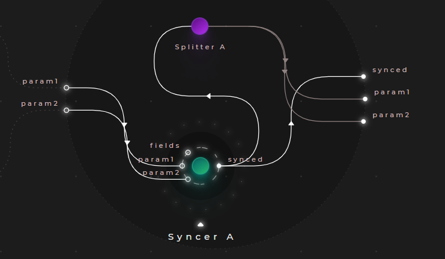
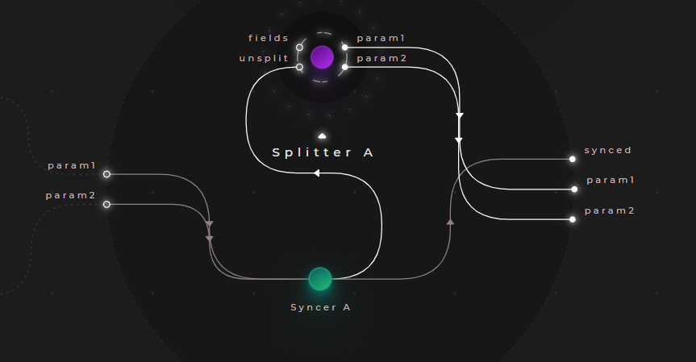
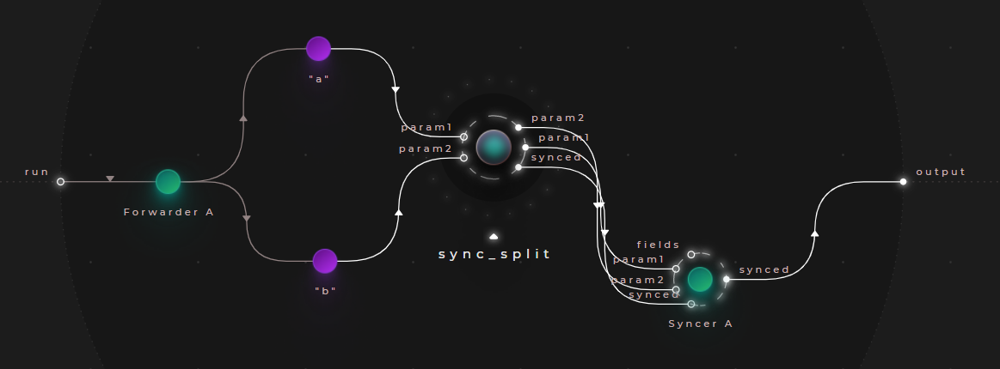
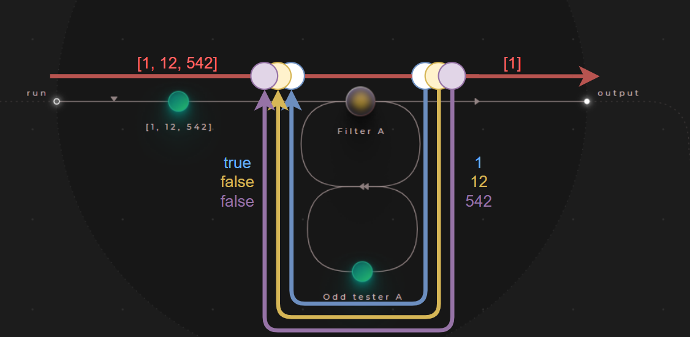
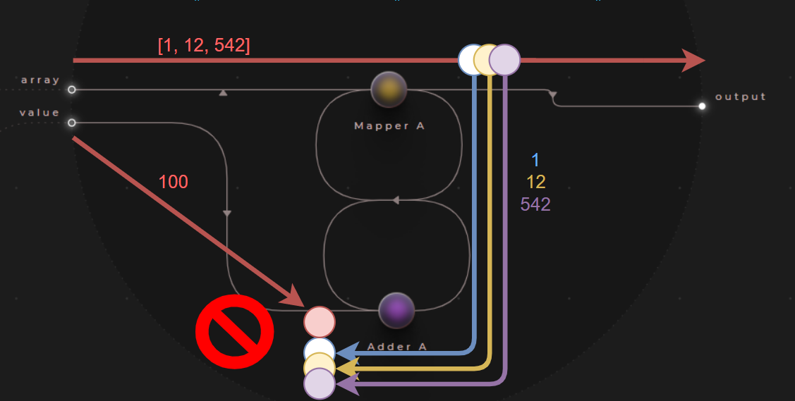
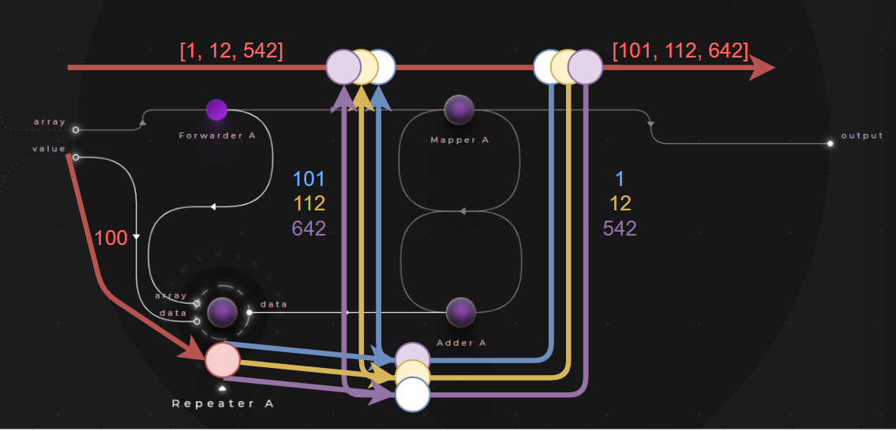

# Synchronization

Cranq offers the following synchronization primitives to manage application flow:

### Syncer & splitter

The ```flow/Syncer``` aggregates the input signals & forwards it only, once all of its inputs received a trigger. 
- Its counterpart is ```flow/Splitter```, which is capable of splitting up the aggregated signal to the original signals.
- They both have dynamic input/output ports (spread ports), allowing the developer to scale them as needed
- They are useful for building a synchronization point on node inputs, making sure the node executes only once all (or some) of its inputs are fulfilled
- They can also be used for merging & splitting data structures, as [demonstrated later](cranqj/app_flow_sync_split.cranqj)

### Multiplexing & demultiplexing

The ```flow/Multiplexer``` node also combines several inputs into a single output, without synchronization
- The input is forwarded immediately, retaining the input port the original signal was received on. 
- Its counterpart is ```flow/Demultiplexer```
- They both have dynamic input/output ports (spread ports), allowing the developer to scale them as needed

### Repeater

The ```flow/Repeater``` node duplicates the signal it receives, assigning unique tags to each.
- It assigns a unique, sequentially indexed tag to each duplicate
- It also has a derivative for arrays, ```data/array/Repeater```, which repeats the input signal for each array element
- These nodes are useful for providing external input values for iterators, filters,mappers & reducers

## Example - Synchronizing node inputs

> **_Try out:_**
>
> Place node **tutorials/flow/Syncer & splitter example**

> **_More info:_**
>
> For data manipulation use cases of the syncer/splitter nodes, check out  **[Constructing data - Using the flow/Syncer & Splitter nodes for data manipulation](../../2_constructing_data/2_3_syncer_splitter/README.md)**


This example demonstrates the basic usage of the ```flow/Syncer``` & ```flow/Splitter``` nodes.



Let's create a node with 2 inputs, and connect them to a ```flow/Syncer```.
- Set the ```fields``` input to a static value of ```["param1","param2"]``` - the ports ```param1``` & ```param2``` will appear
- Connect these to the inputs
- Create an output port called ```synced```, and connect it to the syncer




We can also place a ```flow/Splitter```, and split up the signal again - it can be configured in the same way as the ```flow/Syncer```.



To observe the result, we can wrap this node & drive it with some test data. Note the extra ```flow/Syncer``` here - it takes all 3 arguments produced by the node we just created, to create an output like this:

### Sample output:

```json
{
  "param1": "a",
  "param2": "b",
  "synced": {
    "param1": "a",
    "param2": "b"
  }
}
```

As we can see, the output of the ```flow/Syncer``` is a dictionary of its input values - as a result, it can also be used for constructing data, as demonstrated in later examples.

## Example - Using parameters with enumeration nodes

> **_Try out:_**
>
> Place node **tutorials/flow/Repeater example**

As mentioned [previously](../1_1_junctions/README.md), iterators & its derivatives (filters, mappers, reducers) create a new signal with a different tag for each item they process, which cannot be directly synchronized with the original signal. 

The nodes that have this characteristics are the:
- ```data/array/Iterator```
- ```data/dictionary/Iterator```
- ```data/array/Filter```
- ```data/array/Reducer```
- ```data/array/Mapper```

Take the case of [**Example - Synchronous filtering**](../1_2_iterators/README.md) as an example - for an array of ```[1, 12, 542]```, the following signals will be propagated:



- The ```filter``` node here will create a separate signal with a different tag - represented as separate colours - for each array item
- It needs this, because it needs to collect the result for every item, before it can summarize & output the result
- It does so, by making sure, that result for all the tags it sent out are accounted for
- In Cranq, only signals with matching tags can be synchronized

Now let's implement a node, that takes an array & a numeric value of arguments, adding this value to each element of the array.
- For this, we can use the ```data/array/Mapper``` node as before
- Connect an ```number/Add``` to the mapper

If we were to connect the ```value``` input to the ```number/Add``` directly, the following situation would take place: 



Our code would not work, because the signals received by the ```number/Add``` from the ```data/array/Mapper``` & and the ```value``` input have different tags, and as such, would not be able to synchronize. Therefore, the adder node would not execute.

To tackle this situation, we must create a signal for the value input as well, with the appropriate tags. To accomplish this, we can use the ```data/array/Repeater``` node:



The repeater will perform the same signal forking as the mapper node, creating a new signal carrying our value, with a tag for every array iteration. To allow it to do this, it must also receive the array we are iterating over.

To summarize:

- Let's place a ```data/array/Mapper``` and route the input array into it
- Let's also connect its ```item``` output to a ```number/Add``` node
- Place a ```data/array/Repeater```, and 
  - Connect the value & array inputs to it
  - Connect its output to the ```number/Add``` node
- Finally, route the result of the ```number/Add``` node back to the mapper

### Test data
```json
# array
[
  1, 
  12, 
  542
]
# value
100
```

### Sample output:

```json
[
  101,
  112,
  642
]
```