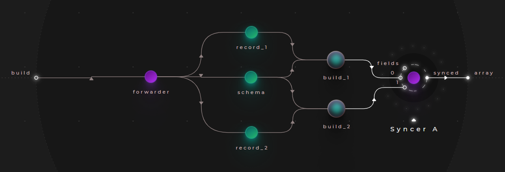
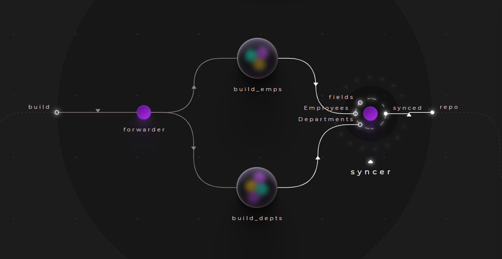
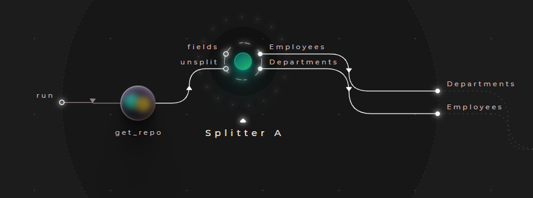

# Using the flow/Syncer & Splitter nodes for data manipulation

The ```flow/Syncer``` node in Cranq is a synchronization primitive, that combines the data content of it's input signals into a single output stucture. It can be construct both arrays & dictionaries.

The syncer node features a dynamic input port set (spread port):
- It's ```fields``` input takes an array, which determines the quantity and names of its input ports
- The names of these input ports will determine whether the node creates an array, or a dictionary

For example:
 - ```fields``` value ```[0,1,2]``` will result in ports ```0, 1, 2```, and will yield an array with 3 elements
 - ```fields``` value ```["a","b","c"]``` will result in ports ```a, b, c```, and will produce a dictionary with 3 elements

> **_More info:_**
>
> For application flow use cases of the syncer/splitter nodes, check out  **[Application flow - Synchronization](../../1_application_flow/1_3_synchronization/README.md)**

## Example - Building arrays with values

> **_Try out:_**
>
> Place node **tutorials/data/Syncer (build emps array) example**

STO? source node?
Let's take the schema created in [Example - Building a record](../2_2_builders/README.md), and construct a collection of employee records:



- Let's create 2 employee records, by channeling our test data into a ```data/dictionary/Builder/keys & values``` node, as illustrated in the [example](../2_2_builders/README.md) mentioned above:
    ```json
    # schema:
    ["EmpID","Name","Dept","HireDate","Salary"]

    # record_1:
    [100,"Ted","Accounting","2020-11-08",1500]

    # record_2:
    [101,"Sue","Facilities","2019-02-13",1500]
    ```
- Merge them together with the flow/Syncer node
  - Note, that we are using the array-building feature of the node in this example
  - We use  ```[0, 1]``` as it's fields input


### Sample output:

```json
[
  {
    "EmpID": 101,
    "Name": "Sue",
    "Dept": "Facilities",
    "HireDate": "2019-02-13",
    "Salary": 1500
  },
  {
    "EmpID": 100,
    "Name": "Ted",
    "Dept": "Accounting",
    "HireDate": "2020-11-08",
    "Salary": 1500
  }
]

```


## Example - Combining records

> **_Try out:_**
>
> Place node **tutorials/data/Syncer (build dictionary) example**

In this example, let's create a collection describing the departments, and combine it with employees collection created in the previous example, to establish a repository:



STO?
- Let's combine the node created in the previous [Example - Building arrays with values]() with a department collection - you don't have to create them now, they are included as:
  - ```tutorial/data_constr/Syncer (build emps array) example```
  - ```tutorials/data/Syncer (build depts array) example``` 
- Connect the employee & department records together with a flow/Syncer node
  - Use the values ```["Employees","Departments"]``` as the "fields" input

### Sample output:

```json
{
  "Employees": [
    {
      "EmpID": 101,
      "Name": "Sue",
      "Dept": "Facilities",
      "HireDate": "2019-02-13",
      "Salary": 1500
    },
    {
      "EmpID": 100,
      "Name": "Ted",
      "Dept": "Accounting",
      "HireDate": "2020-11-08",
      "Salary": 1500
    }
  ],
  "Departments": [
    {
      "Dept": "Accounting",
      "Head": "Joan"
    },
    {
      "Dept": "Facilities",
      "Head": "Frank"
    },
    {
      "Dept": "Legal",
      "Head": "Louis"
    }
  ]
}
```


## Example - Splitting records by keys

> **_Try out:_**
>
> Place node **tutorials/data/Splitter (split dicionary) example**

The ```flow/Syncer``` has an inverse node, ```flow/Splitter```, which can be used to split an array or dictionary by it's elements or items.

It's signature and mechanism is very similar to the syncer, but in this case, the output nodes are dynamic.

Taking the previous example, let's take the just created repository node, and split it up again to "Employees" and "Departments"



- Re-use the created node from the previous example, or place an instance of ```tutorials/data/Syncer (build dictionary) example```
- Place a ```flow/Splitter``` node, and assign the static value ```["Employees", "Departments"]``` to the ```fields``` input
- Note, that this will also work for arrays - in that case, the desired array indexes should be specified

### Sample output:

```json
# Employees output
[
  {
    "EmpID": 101,
    "Name": "Sue",
    "Dept": "Facilities",
    "HireDate": "2019-02-13",
    "Salary": 1500
  },
  {
    "EmpID": 100,
    "Name": "Ted",
    "Dept": "Accounting",
    "HireDate": "2020-11-08",
    "Salary": 1500
  },
  {
    "EmpID": 1,
    "Name": "Joan",
    "Dept": "Accounting",
    "HireDate": "2016-04-28",
    "Salary": 2200
  },
  {
    "EmpID": 2,
    "Name": "Frank",
    "Dept": "Facilities",
    "HireDate": "2011-11-13",
    "Salary": 2000
  },
  {
    "EmpID": 3,
    "Name": "Louis",
    "Dept": "Legal",
    "HireDate": "2015-09-01",
    "Salary": 3000
  }
  ]
# Departments output
[
  {
    "Dept": "Accounting",
    "Head": "Joan"
  },
  {
    "Dept": "Facilities",
    "Head": "Frank"
  },
  {
    "Dept": "Legal",
    "Head": "Louis"
  }
]
```