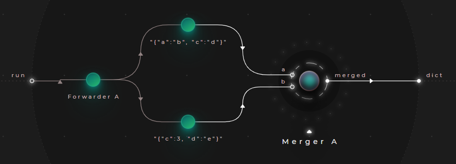
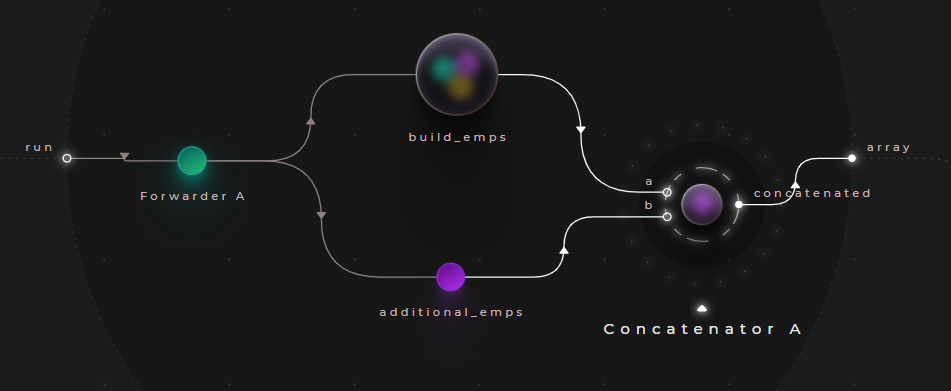

# Merging & concatenation

## Example - Merging dictionaries

> **_Try out:_**
>
> Place node **tutorials/data/Merger (dictionary) example**

Dictionaries in Cranq can be merged with the ```data/dictionary/Merger``` node.
- The node simply takes 2 dictionaries
- If the keys conlict, then the values in "b" take precedence



### Sample output:

```json
{
  "a": "b",
  "c": 3,
  "d": "e"
}
```

## Example - Concatenating arrays

> **_Try out:_**
>
> Place node **tutorials/data/Concatenator (array) example**

Concatenating arrays in Cranq can be performed with the ```data/array/Concatenator``` node.



- It simply takes 2 arrays & applies the items of "b" onto "a", in order
- The example combines the node (```tutorials/data/Syncer (build emps array) example```) created in **[Example - Initializing an array with values](../2_3_syncer_splitter/README.md)** & the following test data:
```json
[
	{
        "EmpID": 1,
        "Name": "Joan",
        "Dept": "Accounting",
        "HireDate": "2016-04-28",
        "Salary": 2200
    }, {
        "EmpID": 2,
        "Name": "Frank",
        "Dept": "Facilities",
        "HireDate": "2011-11-13",
        "Salary": 2000
    }, {
        "EmpID": 3,
        "Name": "Louis",
        "Dept": "Legal",
        "HireDate": "2015-09-01",
        "Salary": 3000
    }
]
```

### Sample output:

```json
[
  {
    "EmpID": 101,
    "Name": "Sue",
    "Dept": "Facilities",
    "HireDate": "2019-02-13",
    "Salary": 1500
  },
  {
    "EmpID": 100,
    "Name": "Ted",
    "Dept": "Accounting",
    "HireDate": "2020-11-08",
    "Salary": 1500
  },
  {
    "EmpID": 1,
    "Name": "Joan",
    "Dept": "Accounting",
    "HireDate": "2016-04-28",
    "Salary": 2200
  },
  {
    "EmpID": 2,
    "Name": "Frank",
    "Dept": "Facilities",
    "HireDate": "2011-11-13",
    "Salary": 2000
  },
  {
    "EmpID": 3,
    "Name": "Louis",
    "Dept": "Legal",
    "HireDate": "2015-09-01",
    "Salary": 3000
  }
]
```