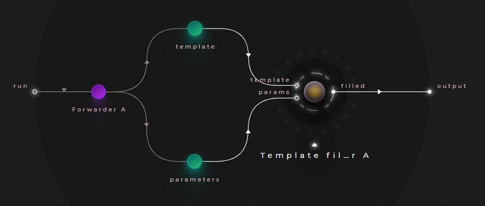

# Using templates

Cranq offers a built-in templating node, ```string/Template filler``` that can also be used to construct your application data. 

The node takes a string template and a dictionary or parameters.
- The ```template``` should contain the tokens to be replaced, in the following format: ```{key}```
- The ```parameters``` input accepts a dictionary - it's keys will be matched against the discovered tokens in the ```template```, and replaced with the corresponding values


## Example - Filling string templates

> **_Try out:_**
>
> Place node **tutorials/data/Template filler example**

The example below illustrates a basic usage of the ```string/Template filler``` node.



### Test data

```json
# template
"{lastName}, {firstName}"

# parameters
{
    "firstName":"John",
    "lastName":"Doe"
}   
```

### Sample output

```json
"John, Doe"
```