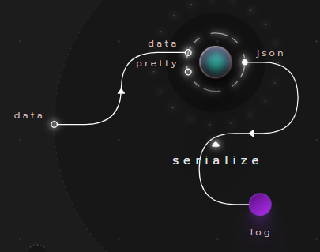
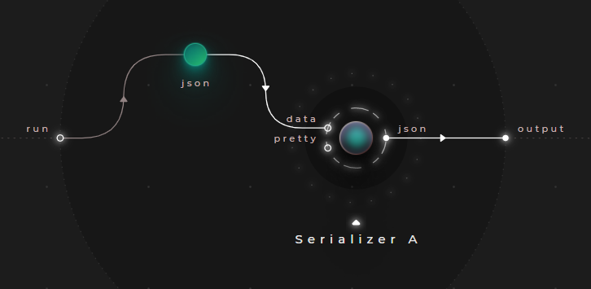
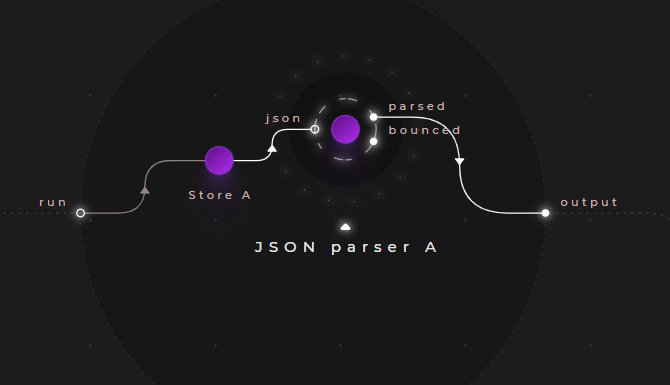

# Serialization

Cranq supports JSON serialization / deserialization out of the box, for array and dictionary types & their combinations.

For serializing a JSON structure to a string, the ```json/Serializer``` node can be used.
- It takes a structure as an input
- It works universally for arrays and dictionaries alike

In fact, the ```debug/Data logger``` node we used in the examples so far uses this node:



For the other way around, there are separate nodes for arrays, and dictionaries.
- ```data/array/JSON parser``` for arrays
- ```data/dictionary/JSON parser``` for dictionaries

These nodes also offer a ```bounced``` output, that indicates, whether the deserialization succeeded, or not - if the serialization fails, the input data is forwarded to this output.

## Example - Serializing structures

> **_Try out:_**
>
> Place node **tutorials/data/Serializer example**

This example illustrates the basic usage of the ```json/Serializer``` node.

### Test data

```json
{"a":1, "b":"value"}
```



Setting the ```pretty``` input to ```true``` will format the output in a human-readable form.

### Sample output

```string
{
  "a": 1,
  "b": "value"
}
```

## Example - Parsing JSON structures

> **_Try out:_**
>
> Place node **tutorials/data/JSON parser example**

String representations of JSON structures can be parsed with the ```data/dictionary/JSON parser``` node. The following example illustrates its basic usage:



- Should the parsing fail, the unchanged input will appear on the node's ```bounced``` output.


### Test data

```string
"{\"a\":1, \"b\":\"value\"}"
```

### Sample output

```json
{
  "a": 1,
  "b": 24
}
```