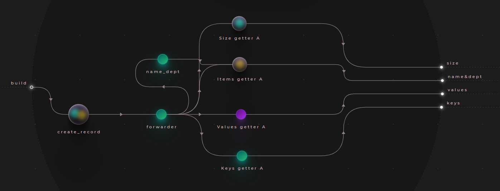
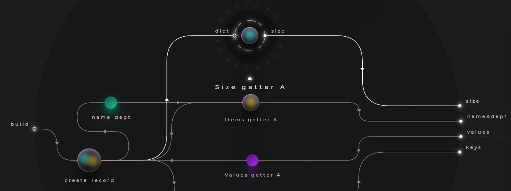
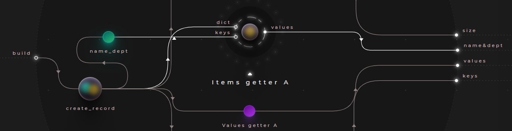
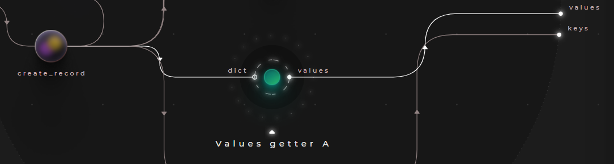
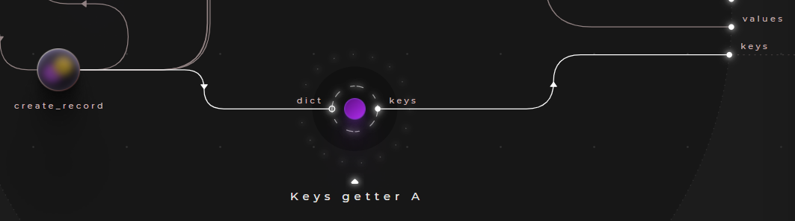
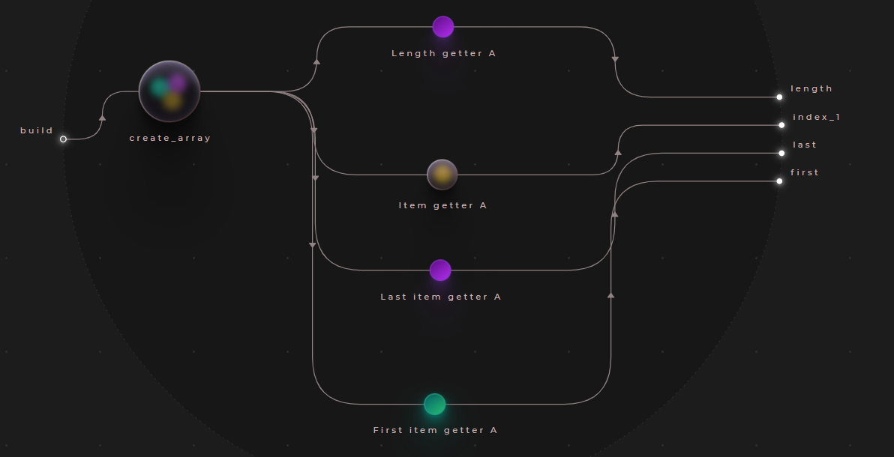
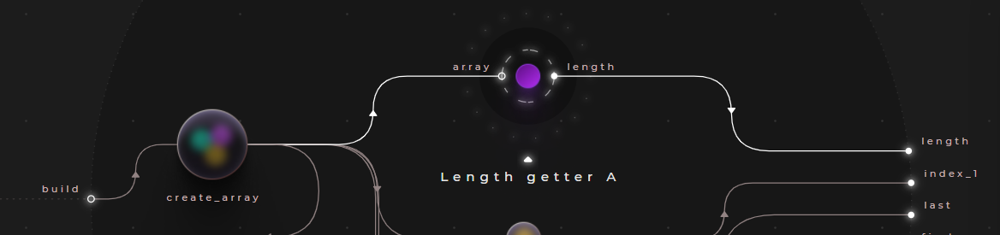
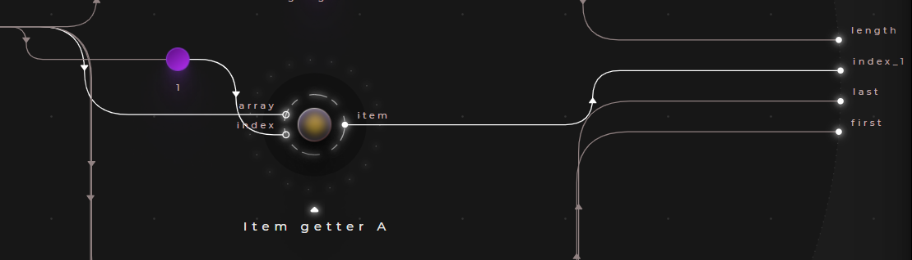
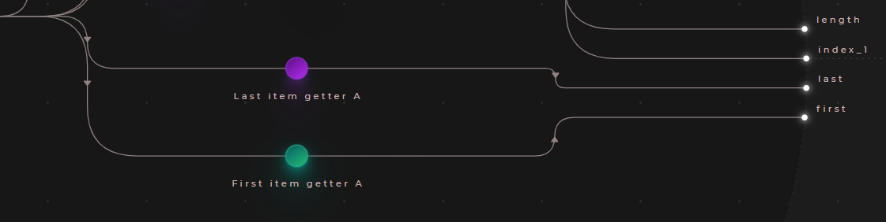

# Using getters

Getters are the atomic operation of querying in Cranq. There are number of built-in nodes offered for retrieving values from a collection or structure.

## Example - Getting data from dictionaries

> **_Try out:_**
>
> Place node **tutorials/data/Getter (dictionary) example**

In this example, we will demonstrate the basic scenarios of retrieving data from dictionaries.

These examples use the record generated in **[Example - Building a record](../../2_constructing_data/2_2_builders/README.md)**, to extract some information. 
- Place an instance of the tutorial node ```tutorials/data/Builder (dictionary) example```
- Alternatively, you can build or specify your own

### Test data:

```json
{
  "EmpID": 101,
  "Name": "Sue",
  "Dept": "Accounting",
  "HireDate": "2019-02-13",
  "Salary": 1500
}
```



## Getting dictionary size

Getting the size (key-value pair count) of a dictionary can be performed with the ```data/dictionary/Size getter``` node.



### Sample output

```json
5 
```

## Getting dictionary values by key

Retrieving specific values by their keys is possible with the ```data/dictionary/Items getter``` node. 



- Besides the dictionary itsef, it takes an array of one or more desired keys.
- In this example, we take the "Name" & "Dept" properties - by using a store, we supply the ```keys``` input with the ```["Name", "Dept"]``` array.
- The node will output an array of the requested values

### Sample output

```json
[
  "Sue",
  "Accounting"
]
```

## Getting all values from a dictionary

To get all values from a dictionary, the ```data/dictionary/Values getter``` node can be used.



The node will output an array of all the values found in the dictionary.

### Sample output

```json
[
  101,
  "Sue",
  "Accounting",
  "2019-02-13",
  1500
]
```

## Getting all keys from a dictionary

To get all keys from a dictionary, the ```data/dictionary/Keys getter``` node can be used.



The node will output an array of all the keys found in the dictionary.

### Sample output

```json
[
  "EmpID",
  "Name",
  "Dept",
  "HireDate",
  "Salary"
]
```


## Example - Getting data from arrays

> **_Try out:_**
>
> Place node **tutorials/data/Getter (array) example**

In this example, we will demonstrate the basic scenarios of retrieving data from arrays.

The example uses the employee list generated in **[Example - Building arrays with values](../../2_constructing_data/2_3_syncer_splitter/README.md)**, to extract some information. 
- Place an instance of the tutorial node ```tutorials/data/Syncer (build emps array) example```
- Alternatively, you can build or specify your own

### Test data:

```json
[
  {
    "EmpID": 101,
    "Name": "Sue",
    "Dept": "Facilities",
    "HireDate": "2019-02-13",
    "Salary": 1500
  },
  {
    "EmpID": 100,
    "Name": "Ted",
    "Dept": "Accounting",
    "HireDate": "2020-11-08",
    "Salary": 1500
  }
]
```




## Getting array length

Getting the length of an array can be performed with the ```data/array/Length getter``` node.



### Sample output

```json
2
```

## Getting array element by index

Getting an array element by it's index can be performed with the ```data/array/Item getter``` node.



### Sample output

```json
# index: 1

{
  "EmpID": 100,
  "Name": "Ted",
  "Dept": "Accounting",
  "HireDate": "2020-11-08",
  "Salary": 1500
}
```

Specifying an out-of-bound index will result in an empty output:

```json
# index: 8

undefined 
```

## Getting the first & last array elements

Cranq offers short-hand nodes for getting the first & last elements.
- Use ```data/array/Last item getter``` for getting the last element
- Use ```data/array/First item getter``` for getting the first element



### Sample output

```json
# data/array/First item getter
{
  "EmpID": 101,
  "Name": "Sue",
  "Dept": "Facilities",
  "HireDate": "2019-02-13",
  "Salary": 1500
} 

# data/array/Last item getter
{
  "EmpID": 100,
  "Name": "Ted",
  "Dept": "Accounting",
  "HireDate": "2020-11-08",
  "Salary": 1500
}
```


