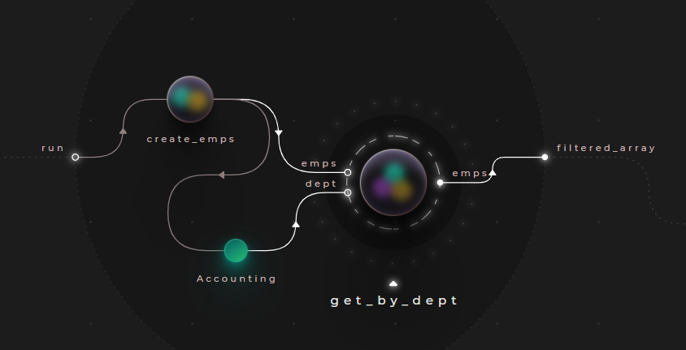
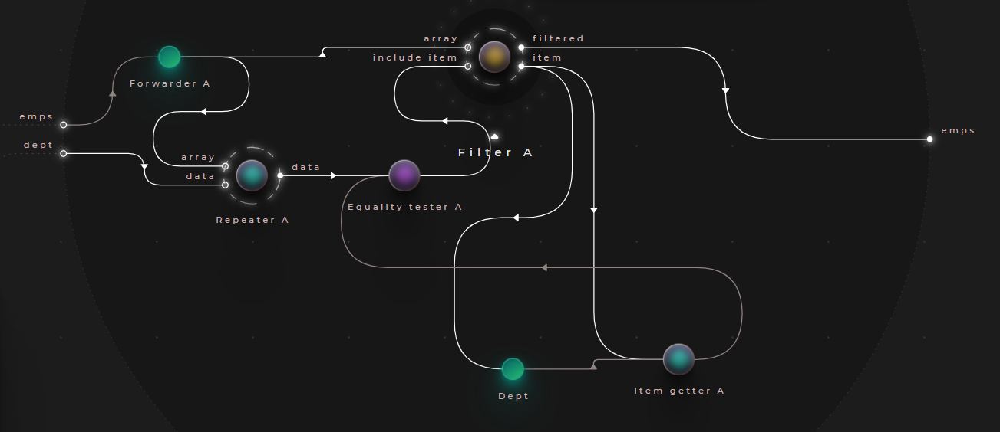

# Using filters

## Example - Filtering an array

> **_Try out:_**
>
> Place node **tutorials/data/Filter (query) example**

> **_More info:_**
>
> For application flow use cases of filters, check out  **[Application flow - Iterators / loops](../../1_application_flow/1_2_iterators/README.md)**

In **[Example - Concatenating arrays](../../2_constructing_data/2_4_merge_concat/README.md)**, we created an array of employee records - let's take this dataset, and implement a node, that returns all employees working for a specified department.

As a reminder, here is our test dataset:

### Test data:

```json
[
  {
    "EmpID": 101,
    "Name": "Sue",
    "Dept": "Facilities",
    "HireDate": "2019-02-13",
    "Salary": 1500
  },
  {
    "EmpID": 100,
    "Name": "Ted",
    "Dept": "Accounting",
    "HireDate": "2020-11-08",
    "Salary": 1500
  },
  {
    "EmpID": 1,
    "Name": "Joan",
    "Dept": "Accounting",
    "HireDate": "2016-04-28",
    "Salary": 2200
  },
  {
    "EmpID": 2,
    "Name": "Frank",
    "Dept": "Facilities",
    "HireDate": "2011-11-13",
    "Salary": 2000
  },
  {
    "EmpID": 3,
    "Name": "Louis",
    "Dept": "Legal",
    "HireDate": "2015-09-01",
    "Salary": 3000
  }
]
```



- Place an instance of the node ```tutorials/data/Concatenator (array) example``` implemented in the previous example (or create it now)
- Then create a new node "get_by_dept" that performs the filtering
  - Create 2 input ports, ```emps``` will take the employee records, while ```dept``` will take the deparment we are filtering against
  - Connect the nodes as seen above



Drilling into our new node, we have to do a couple of things:
- Route our employees array into a ```data/array/Filter``` node
- For each ```item```, get the property value we would like to check for, using the ```data/dictionary/Item getter``` node
- We route the output of the item getter node into a ```string/Equality tester``` node. This will decide, whether the current item will be included in the result set, or not.
- As discussed in **[Example - Using parameters with iterators](../../1_application_flow/1_3_synchronization/README.md)**, the filter node creates a new signal for the processing of each element: 
  - We can't route our filter condition, the ```dept``` input directy to the equality tester - instead, we have to route it into a ```data/array/Repeater``` node first, allowing it to repeat our signal for each filtering iteration

> **_More info:_**
>
> For more information about using the enumeration nodes with parameters & the usage of the repeater, check out  **[Example - Using parameters with iterators](../../1_application_flow/1_3_synchronization/README.md)**

### Sample output

```json
[
  {
    "EmpID": 100,
    "Name": "Ted",
    "Dept": "Accounting",
    "HireDate": "2020-11-08",
    "Salary": 1500
  },
  {
    "EmpID": 1,
    "Name": "Joan",
    "Dept": "Accounting",
    "HireDate": "2016-04-28",
    "Salary": 2200
  }
]
```