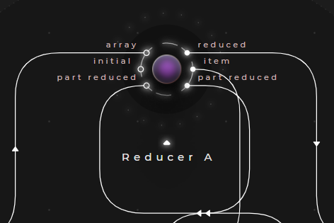
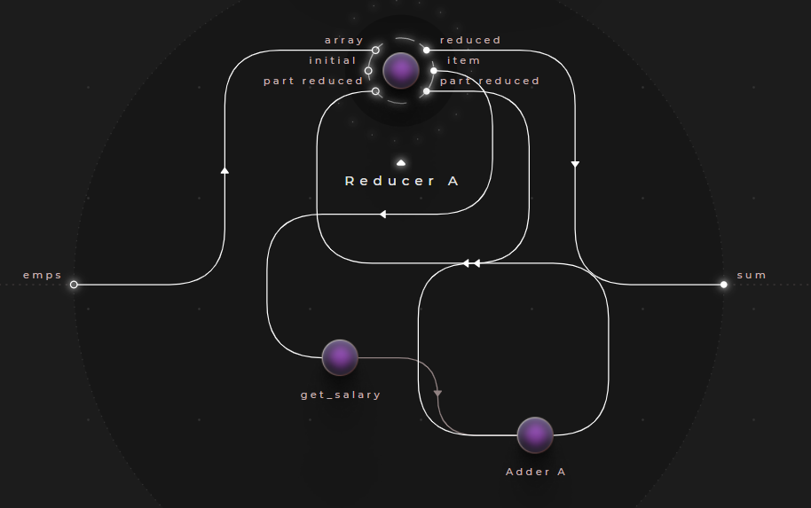

# Using reducers

Reducers are akin to mappers - instead of mapping each collection item to another, they are designed to map the entire collection into a single item. In Cranq, the ```data/array/Reducer``` node can be used for this purpose.



- The node takes an ```array``` as its input
- It iterates through the array items, and yields each on its ```item``` output
- It also outputs the current result on its ```part reduced``` output
- The developer should perform the required transformations by using the current item and reduction result, and route the resulting value back to the ```part reduced``` input
- An ```initial``` value should also be specified - this value will be present on the ```part reduced``` output, when the first item is being processed
- Once each iteration is accounted for on the ```part reduced``` input, the node outputs the final result on its ```reduced``` output

## Example - Summing array values

> **_Try out:_**
>
> Place node **tutorials/data/Reducer (query) example**

> **_More info:_**
>
> For application flow use cases of reducers, check out  **[Application flow - Iterators / loops](../../1_application_flow/1_2_iterators/README.md)**

In **[Example - Concatenating arrays](../../2_constructing_data/2_4_merge_concat/README.md)**, we created an array of employee records - let's take this dataset, and implement a node, that calculates the sum of employee salaries.

As a reminder, here is our test dataset:

### Test data:

```json
[
  {
    "EmpID": 101,
    "Name": "Sue",
    "Dept": "Facilities",
    "HireDate": "2019-02-13",
    "Salary": 1500
  },
  {
    "EmpID": 100,
    "Name": "Ted",
    "Dept": "Accounting",
    "HireDate": "2020-11-08",
    "Salary": 1500
  },
  {
    "EmpID": 1,
    "Name": "Joan",
    "Dept": "Accounting",
    "HireDate": "2016-04-28",
    "Salary": 2200
  },
  {
    "EmpID": 2,
    "Name": "Frank",
    "Dept": "Facilities",
    "HireDate": "2011-11-13",
    "Salary": 2000
  },
  {
    "EmpID": 3,
    "Name": "Louis",
    "Dept": "Legal",
    "HireDate": "2015-09-01",
    "Salary": 3000
  }
]
```


- Place an instance of the node ```tutorials/data/Concatenator (array) example``` implemented in the previous example (or create it now)
- Then create a new node "sum_emp_salary" that will perform the calculation
  - Create an input/output pair, and connect the test data provider node to its input



- Drilling into the new node, place a reducer & set its ```initial``` input to a static value of ```0```
- Connect the ```item``` output to a ```dictionary/Item getter```, that will select the salary property of each item - set its ```key``` input to a static value of ```"Salary"```
- Place a ```number/Adder``` node, and connect its inputs to:
  - The result of the aforementioned node
  - The ```part reduced``` node of the reducer
- Route the result of the add node back to the ```part reduced``` input of the reducer
- Finally, the ```reduced``` output of the reducer can be wired to the node output