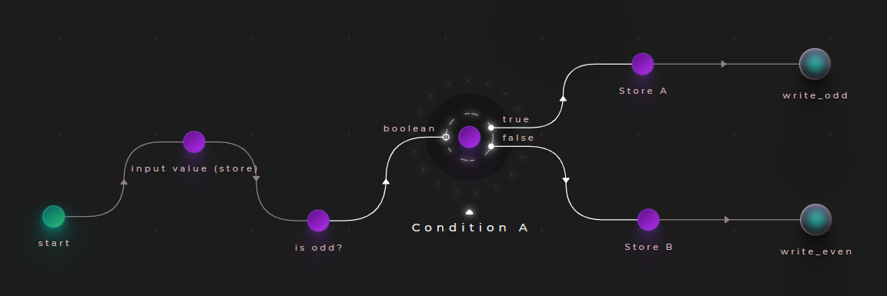
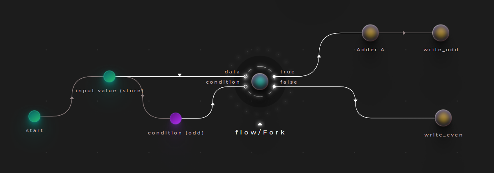

# Conditions

In Cranq, the imperative IF/ELSE statement can be performed by using:

### A "Fork" node:

Fork is a dataflow operation, which directs it's input signal to one of two directions, determined by a boolean condition. Essentially, it acts like a railway junction. In Cranq, it is implemented in the "flow/Fork" node.

Use "Fork":
- if you need to forward the data being inspected

### A "Condition" node:

If the redirection of the entire signal is not necessary, the "flow/Condition" node may be used - it simply triggers a signal on it's appropriate output, determined by a single boolean input.

Use "Condition":
- to transfer control only, without propagating the data

### A "Gate" node:

TODO

## Example 2.1

Let's implement a simple application, that determines whether an input number is even, or odd.

To accomplish this, we will connect our input to the built-in "number/Odd tester" node, and route it's output to a "flow/Condition" node instance.

## Example 2.2

Let's change our application in the following way:
- Increment odd numbers by 1
- Leave even numbers be
- Output the result

We will use the "flow/Fork" node for this purpose. Replace the "Condition" node in the previous example, connecting it like so:

Place an adder node on the "true" branch of the fork node, and connect it to the writer node. The "false" branch should be connected directly to its output.

## Example 2.3

TODO: gate node