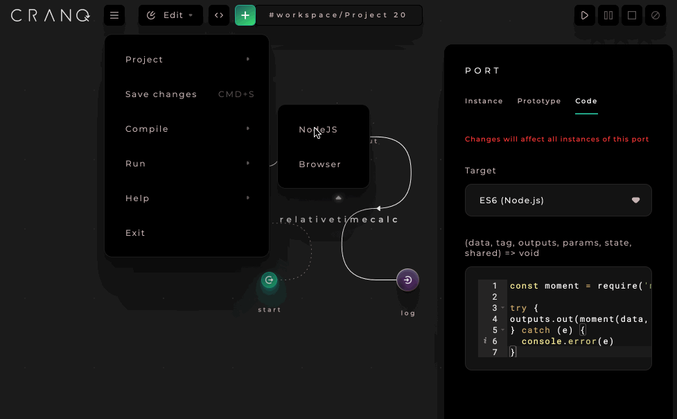

# Setting up Ganache with Metamask

## Steps

1. Download Ganache from: [https://trufflesuite.com/ganache/](https://trufflesuite.com/ganache/)\
   \
   .png>)
2. Install Ganache
3. Run Ganache
4. Select QUICKSTART ETHEREUM as workspace\
   \
   .png>)
5. Goto setting\
   \
   .png>)
6. Select SERVER tab\
   \
   
7. Select 127.0.0.1 as HOSTNAME\
   \
   
8. Switch off AUTOMINE toggle\
   \
   .png>)
9. Set MINING BLOCK TIME to 10\
   \
   .png>)
10. Click on SAVE AND RESTART\
    \
    .png>)
11. Setting up ganache network in Metamask
    1. Open Metamask\
       \
       .png>)
    2. Select Settings\
       \
       .png>)
    3. Select Networks\
       \
       .png>)
    4. Click on Add Network\
       \
       .png>)
       1. Set the Network Name e.g ganache\
          \
          .png>)
       2. The RPC URL value comes from ganache\
          \
          .png>)\
          \
          .png>)
       3. Set the Chain ID
          1. Type e.g 1 and a hint appears about the exact Chain ID so use that.\
             \
             .png>)
          2. **Type the suggested chain id which is 1337.**\
             \
             .png>)
       4. Set the Currency symbol\
          \
          .png>)
       5. Click on Save\
          \
          .png>)
    5. Open My accounts\
       \
       .png>)
    6. Import your Ganache account&#x20;
       1. Click on Show keys of the account to import in Ganache\
          \
          .png>)
       2. Copy the PRIVATE KEY\
          \
          .png>)
       3. Open Metamask\
          \
          .png>)
       4. Open My Accounts\
          \
          .png>)
       5. Select Import Account\
          \
          .png>)
       6. Enter your private key and import\
          \
          .png>)\
